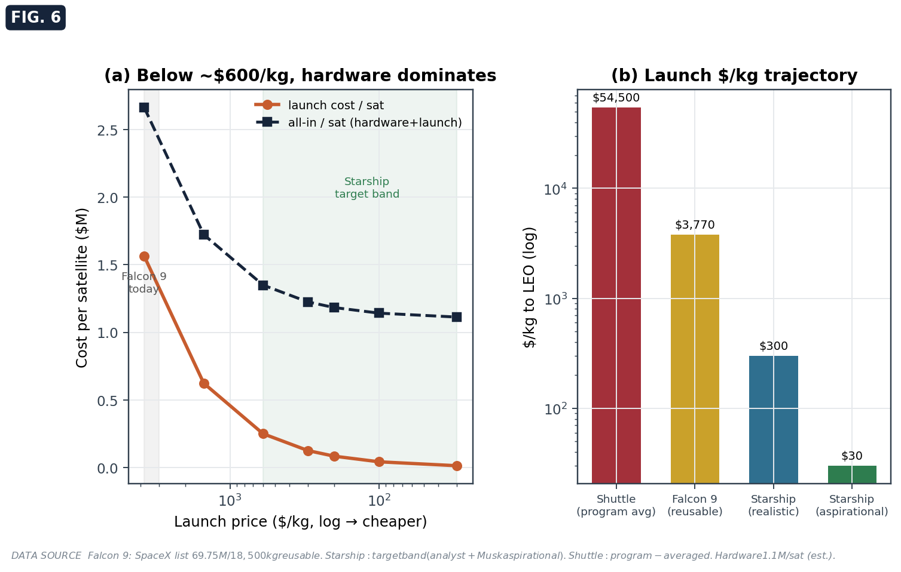

# Space-Based AI Data Centers, Part II
## Survivability, Reliability, and Launch Architecture: A Verified Systems Assessment with Full Mathematical Foundation

**Author:** Samarjith Biswas, PhD
**Document type:** Independent engineering assessment (continuation of a November 2025 thermal study)
**Edition:** Complete, verified-data revision, June 2026
**Reference system:** Google Project Suncatcher (Agüera y Arcas et al., 2025, arXiv:2511.19468)

---

### Abstract

A prior study (November 2025) showed that passive radiative cooling can keep a TPU-class
accelerator within its junction-temperature limit in low Earth orbit. This complete
continuation tests the harder question that study excluded: whether the *system* survives a
multi-year mission in the real LEO environment, and whether it can be launched and disposed
of responsibly. Every input has been re-verified against primary sources (NASA, ESA, FCC,
the NRLMSIS atmosphere model, vendor datasheets, and the Project Suncatcher paper), and
several figures from the first study are corrected. Each technical section presents its
finding, the governing equations derived from first principles, the figure, and a worked
example whose result reproduces the figure to the quoted precision. The headline result is
that thermal management, now flight-demonstrated by Starcloud's orbital H100, is the *solved*
part of the problem; the unsolved parts are orbital-debris survivability in a tight
formation, mandatory active de-orbit (650 km does not meet the current 5-year disposal rule
passively), and economics that do not yet close. The work is fully reproducible.

---

### Nomenclature

| Symbol | Meaning | Units |
|---|---|---|
| $\mu$ | Earth gravitational parameter $=3.986004418\times10^{14}$ | $\mathrm{m^3\,s^{-2}}$ |
| $R_E$ | Earth mean radius $=6.371\times10^{6}$ | $\mathrm{m}$ |
| $\sigma$ | Stefan–Boltzmann constant $=5.670374\times10^{-8}$ | $\mathrm{W\,m^{-2}\,K^{-4}}$ |
| $g_0$ | standard gravity $=9.80665$ | $\mathrm{m\,s^{-2}}$ |
| $a,\;h$ | orbital radius (circular) ; altitude $h=a-R_E$ | $\mathrm{m}$ |
| $v$ | orbital speed | $\mathrm{m\,s^{-1}}$ |
| $\rho$ | neutral atmospheric mass density | $\mathrm{kg\,m^{-3}}$ |
| $C_D,\;A/m$ | drag coefficient ($\approx2.2$) ; area-to-mass ratio | – , $\mathrm{m^2\,kg^{-1}}$ |
| $\varepsilon,\;\alpha_s$ | IR emissivity ; solar absorptivity | – |
| $T,\;Q,\;R_{th}$ | temperature ; heat load ; thermal resistance | $\mathrm{K}$ , $\mathrm{W}$ , $\mathrm{K\,W^{-1}}$ |
| $\Phi$ | cumulative debris flux | $\mathrm{m^{-2}\,yr^{-1}}$ |
| $\Delta v,\;I_{sp}$ | velocity increment ; specific impulse | $\mathrm{m\,s^{-1}}$ , $\mathrm{s}$ |

---

# PART I — CONTEXT

## 1. Purpose and scope

This is an honest revision, not a defense of prior work. Two motivations drove it. First, a
reader correctly asked for a reproducible, harmonized environment model and a benchmark case;
this revision states every assumption and derives every equation. Second, a reader correctly
argued that the first study ignored the hardest part of the space environment (radiation,
debris, collision avoidance, end-of-life); this revision treats those as the central problem
and quantifies them. A third motivation is internal: the first study contained one outright
error (the disposal claim) and one optimistic assumption (the chip power). Both are corrected
in Section 2.

The reference architecture is Google's Project Suncatcher, whose published parameters are now
confirmed (Section 3). The intent is constructive: to identify the true critical path so that
demonstrator missions, which Google, Starcloud, and Axiom are now flying, target the risks
that actually matter.

## 2. Corrections to the November 2025 study

| Item | Prior study | Verified value (this revision) | Source |
|---|---|---|---|
| Disposal compliance | "Passive de-orbit within 25 years" | Rule is now **5 years** (FCC, 2022, effective 2024). At 650 km, lifetime $\sim$**22 yr**, failing it. **Active de-orbit mandatory.** | FCC 22-74; NRLMSIS 2.1 |
| TPU v6e power | 300 W/chip | Google publishes **no TDP**; best estimate **$\sim$150–200 W** | The Next Platform; Google Cloud |
| Density @650 km | $6.5\times10^{-14}$ | **$1.6\times10^{-13}\,\mathrm{kg/m^3}$** (moderate), swinging $\sim$100$\times$ over the solar cycle | NRLMSIS 2.1 |
| Debris flux $>$1 cm | $3\times10^{-6}$–$3\times10^{-5}$ | **$1\times10^{-5}$–$1\times10^{-4}\,\mathrm{m^{-2}yr^{-1}}$** | ORDEM 3.1 / MASTER-8 |
| Radiator accounting | single-sided implied | double-sided is physical | NASA practice |
| EOL coating | emphasized $\varepsilon$ loss | dominant mode is **$\alpha_s$ rising 0.15$\to$0.36**; $\varepsilon$ stable | NASA NTRS |
| Falcon 9 cost | "\$3,600/kg" | **$\sim$\$3,770/kg** (list price / reusable payload) | SpaceX |

None of these reverse the first study's thermal conclusion. They relocate the difficulty from
the chip to the spacecraft and the constellation.

## 3. Verified reference environment and system

**Orbit (confirmed):** dawn-dusk sun-synchronous LEO, mean altitude **650 km**, an
**81-satellite** cluster on a square lattice of radius **$R=1\,$km**, with next-nearest spacing
oscillating between **$\sim$100 and 200 m** to close the optical links.

**Optical link (confirmed):** **800 Gbps unidirectional (1.6 Tbps bidirectional)** at
**1.55 µm**, theoretical ceiling 9.6 Tbps with 24-channel DWDM.

**Accelerator (confirmed):** TPU v6e "Trillium," **918 TFLOPS BF16, 32 GB HBM, $\sim$1.6 TB/s**.
Radiation-tested in a **67 MeV proton beam at UC Davis**: 5-year requirement **750 rad(Si)**,
expected LEO dose **$\sim$150 rad(Si)/yr**, limiter is **HBM at $\sim$2 krad(Si)**. Per-chip and
per-satellite power are **not stated**.

**Chips actually flying:** Starcloud-1 flew **one NVIDIA H100 (700 W)** in November 2025 and
trained a model in orbit. Starcloud-2 (Oct 2026) brings **B200 (1000 W)** and GB200-class
(**1200 W/GPU**) parts; the NVL72 rack draws **$\sim$120 kW**. Per-chip power is climbing fast.

**Environment (verified):** ESA 2025 tracks $\sim$**54,000 objects $>$10 cm**, **1.2 M** at
1–10 cm, **130 M** at 1 mm–1 cm. Starlink executed **144,404** collision-avoidance maneuvers in
H1 2025 (with the caveat that the maneuver threshold was lowered during the period).

---

# PART II — ANALYSIS AND MATHEMATICAL FOUNDATION

## 4. Orbital-mechanics preliminaries

For a circular orbit, gravity supplies the centripetal force, $\mu m/a^2 = m v^2/a$, giving the
orbital speed and (from $v=2\pi a/T$) the period:

$$v=\sqrt{\frac{\mu}{a}},\qquad T=2\pi\sqrt{\frac{a^3}{\mu}}.$$

At 650 km ($a=7.021\times10^6\,$m): $v=7534.8\,$m/s and $T=5854.8\,\mathrm{s}=97.6\,$min,
reproducing the Suncatcher orbital period. The specific orbital energy,

$$\mathcal{E}=\frac{v^2}{2}-\frac{\mu}{r}=-\frac{\mu}{2a},$$

is used directly in the decay derivation below.

## 5. End-of-life: atmospheric drag and orbital decay (Fig. 1)

**Finding.** Starlink is disposable by design and decays quickly; a data center is far more
capital, cannot be abandoned, and will not decay in time. At 650 km the natural lifetime is
about **22 years** (moderate solar), **$\sim$4 years** at solar maximum, and **$\sim$312 years**
at solar minimum. Only a satellite that launches into a solar maximum comes close to the
**5-year** FCC rule passively. **Active de-orbit is mandatory.**

**Governing physics.** A satellite of cross-section $A$ at speed $v$ in a gas of density $\rho$
feels drag $F_D=\tfrac12\rho v^2 C_D A$, so the specific deceleration is

$$a_D=\tfrac12\,\rho\,v^2\,C_D\,\frac{A}{m}. \tag{5.1}$$

**Derivation of the decay rate.** Drag removes orbital energy at the rate (force $\times$ speed,
per unit mass)

$$\frac{d\mathcal{E}}{dt}=-a_D v=-\tfrac12\rho C_D\frac{A}{m}v^3, \tag{5.2}$$

while for a near-circular orbit $\mathcal{E}=-\mu/2a \Rightarrow d\mathcal{E}/dt=(\mu/2a^2)\,\dot a$.
Equating, and using $v=\sqrt{\mu/a}$ so $v^3=(\mu/a)^{3/2}$:

$$\frac{\mu}{2a^2}\dot a=-\tfrac12\rho C_D\frac{A}{m}\Big(\frac{\mu}{a}\Big)^{3/2}
\;\Longrightarrow\;
\boxed{\ \dot a=-\,C_D\,\frac{A}{m}\,\rho(h)\,\sqrt{\mu a}\ } \tag{5.3}$$

Because $\rho(h)$ rises steeply as the orbit lowers, decay accelerates into a rapid re-entry.

**Atmosphere model.** $\rho(h)$ uses NRLMSIS 2.1 anchors at 600/650/700/800 km for three
solar-activity levels, interpolated log-linearly,
$\ln\rho=\ln\rho_i+\frac{\ln\rho_{i+1}-\ln\rho_i}{h_{i+1}-h_i}(h-h_i)$. The min-to-max density
ratio is $\sim$100 at this altitude, the dominant lifetime uncertainty (the band in Fig. 1).

**Solution.** Equation (5.3) is integrated by adaptive forward Euler to re-entry at 120 km.

*Figure 1. Natural orbital lifetime versus altitude with the solar-cycle band. At 650 km the
realistic lifetime fails the FCC 5-year rule, so active de-orbit is mandatory.*

## 6. Thermal management: feasibility confirmed, but it does not scale (Fig. 2)

**Finding.** The first study's claim is now flight-proven: an H100 at roughly twice the
modeled power has operated and trained a model in orbit. The problem is that cooling does not
compound. Radiator area scales **linearly** with heat load, and a separate, sharper wall
appears at the chip interface above $\sim$400 W.

**From Planck to Stefan–Boltzmann.** Integrating Planck's spectral radiance over a hemisphere
($\int\cos\theta\,d\Omega=\pi$) and all wavelengths gives the hemispherical emissive power
$E_b=\pi\int_0^\infty B\,d\lambda=\sigma T^4$ with $\sigma=2\pi^5k_B^4/15h^3c^2$. A gray panel
radiating to the $T_\infty=2.725\,$K microwave background rejects

$$Q_{\text{rad}}=\varepsilon\sigma A(T^4-T_\infty^4)\approx\varepsilon\sigma A T^4, \tag{6.1}$$

since $T_\infty^4/T^4\sim10^{-8}$ at $T\sim300\,$K.

**Radiator sizing.** A deployed panel radiates from both faces and loses a parasitic fraction
$f_p$ to absorbed solar/albedo/Earth-IR. The required area for load $Q$ at temperature $T$ is

$$\boxed{\ A_{\text{rad}}=\frac{Q}{\varepsilon\sigma T^4\,n_{\text{sides}}(1-f_p)}\ },
\qquad n_{\text{sides}}=2,\ f_p=0.12, \tag{6.2}$$

**linear in $Q$**: no economy of scale. *Worked example (1 MW, 20 °C, $\varepsilon=0.90$):*
$\varepsilon\sigma T^4=376.9\,\mathrm{W/m^2}$ per side; $q_{\text{net}}=376.9\times2\times0.88=663.3\,\mathrm{W/m^2}$;
$A=10^6/663.3=\mathbf{1508\ m^2}$, matching the industry "$\sim$1,200 m²/MW" rule (which assumes
slightly higher $\varepsilon$ and lower $f_p$). At 60 °C the area falls to $\sim$900 m².

**Inverse problem (fixed area, find $T$).** Solve $f(T)=Q-\varepsilon\sigma A T^4=0$ by Newton's
method, $T_{k+1}=T_k+\dfrac{Q-\varepsilon\sigma A T_k^4}{4\varepsilon\sigma A T_k^3}$, converging
in 3–4 iterations from $T_0=300\,$K.

**Conductive chain and interface saturation.** Heat flows junction $\to$ radiator through
series resistances, $R_{th,\text{sys}}=\sum_i R_i$, so $T_j=T_{\text{rad}}+Q\,R_{th,\text{sys}}$.
With the first study's passive chain $R_{th}=0.30\,$K/W, the rise across the interface alone is
$\Delta T=P\times0.30$: 90 °C at 300 W, but **210 °C at 700 W** and **360 °C at 1200 W**. Since
the entire junction budget is 125 °C, any chip with $P\,R_{th}>125\,$°C, i.e.
**$P>417\,$W**, cannot be cooled passively at any radiator size. H100-class and larger parts
require liquid/loop-heat-pipe cooling at the die, which is what Starcloud and Axiom use.

*Figure 2. (a) Radiator area grows linearly with power. (b) The passive thermal chain
saturates above $\sim$400 W, forcing chip-level active cooling.*

## 7. Radiation and reliability: a quantified tax, not a wall (Fig. 4)

**Finding.** Total ionizing dose is survivable with shielding; single-event effects impose a
permanent throughput tax of order 10–20 % that belongs in any efficiency claim.

**Dose vs shielding.** Behind aluminium of thickness $x$, the trapped-electron dose attenuates
quasi-exponentially atop a proton/bremsstrahlung floor:

$$\dot D(x)=D_0\,e^{-x/\lambda}+D_\infty,\qquad \lambda\approx1.7\ \mathrm{mm}, \tag{7.1}$$

with $D_{\text{tot}}=\dot D\cdot t_{\text{mission}}$. Constants are calibrated to flight/model
data: tens of krad/yr at 1 mm, and a deep-shield floor $D_\infty\sim100$–$160\,$rad/yr matching
SIRI-1 (600 km SSO) and the Suncatcher proton-beam result. *Worked example (10 mm, 5 yr):*
$\dot D_{\text{lo}}=2.0\!\times\!10^4 e^{-10/1.7}+100=156$, $\dot D_{\text{hi}}=266\,$rad/yr;
$D_{\text{tot}}\approx\tfrac12(156+266)\times5\approx\mathbf{1.06\ krad(Si)}$, under the $\sim$2 krad
HBM tolerance (margin $\approx1.9\times$); meeting Google's 750 rad requirement needs $\sim$12 mm.

**Single-event upsets.** The rate scales as $R_{\text{SEU}}=\sigma_{\text{SEU}}\,\phi\,N_{\text{bits}}$,
enhanced in the South Atlantic Anomaly and polar horns. With ECC correcting single-bit errors,
the uncorrectable tail ($\sim10^{-3}R_{\text{SEU}}$) is absorbed by checkpointing. Because AI
inference tolerates bit-flips far better than HPC, the right design is **ECC + checkpointing**
($\sim$86 % usable compute), not full triple-modular redundancy (which halves throughput).

*Figure 4. (a) Cumulative 5-year dose versus shielding; $\sim$10–12 mm Al closes the case.
(b) The reliability/throughput trade.*

## 8. Orbital debris and the in-cluster cascade: the binding constraint (Fig. 3)

**Finding.** Debris survivability in a tight formation is the binding constraint on
constellation-scale orbital data centers, more so than any thermal or radiation question.

**Catastrophic-impact probability (Poisson).** Rare independent impacts make the count Poisson:
from a binomial of $n$ slices each with hit probability $p=\Phi A\Delta t$, taking $n\to\infty$
with $np\to\Lambda$ gives $P(K=k)=\Lambda^k e^{-\Lambda}/k!$ with $\Lambda=\Phi A N t$. The
probability of at least one catastrophic hit in the cluster is

$$\boxed{\ P(K\ge1)=1-e^{-\Phi A N t}\ } \tag{8.1}$$

*Worked example* ($\Phi=3\times10^{-5}\,\mathrm{m^{-2}yr^{-1}}$, $A=15\,\mathrm{m^2}$, $N=81$,
$t=5$): $\Lambda=0.182$, $P=1-e^{-0.182}=\mathbf{16.7\%}$. The flux band $10^{-5}$–$10^{-4}$ maps
to **6 %–46 %** (Fig. 3a); the 10-year central value is $\sim$31 %.

**Cascade coupling (expanding-shell model).** A break-up yields $N_f$ lethal fragments spread
over a sphere $4\pi d^2$ at range $d$; a neighbor of cross-section $\sigma_t=\pi r_t^2$
intercepts an expected $\Lambda_n=N_f r_t^2/4d^2$, so

$$\boxed{\ P_{\text{hit}}(d)=1-\exp\!\Big(-\frac{N_f r_t^2}{4 d^2}\Big)\ } \tag{8.2}$$

*Worked example* ($N_f=2000$, $r_t=2\,$m, $d=150\,$m): $\Lambda_n=8000/90000=0.0889$,
$P_{\text{hit}}=\mathbf{8.5\%}$ per neighbor. Since $P_{\text{hit}}\propto d^{-2}$, widening to
1 km drops coupling below 1 % but degrades the optical-link budget. This is the quantitative
core of the **formation paradox**. Compounding it, ground tracking cannot see the sub-10 cm
fragments that dominate the catastrophic flux, and current designs lack onboard avoidance
sensing.

*Figure 3. (a) Catastrophic debris risk for the full cluster, with model band. (b) In-cluster
cascade coupling versus formation spacing; the Suncatcher baseline sits in the worst region.*

## 9. Station-keeping and the formation paradox

Holding a sub-200 m formation at 650 km is hard because drag is small but non-zero, varies
$\sim$100$\times$ over the solar cycle, and acts differentially across satellites of slightly
different ballistic coefficient. When the spacing budget is 150 m, tens of meters of drift per
orbit consume most of the margin. As Section 10 shows, the propellant cost is small; the
difficulty is **control and sensing, not fuel**. The paradox is that the same tight spacing
that enables terabit optical links makes collision avoidance dangerous, because a satellite
dodging debris becomes a hazard to its neighbors. Resolving it requires cluster-level
coordinated maneuvering, an unsolved autonomy problem at this density.

## 10. The Δv budget and disposal propulsion (Fig. 5)

**Finding.** The 5-year budget is small in propellant ($\sim$190 m/s total) but dominated by the
$\sim$132 m/s de-orbit term, the line item that separates a disposable Starlink from a
non-disposable data center.

**Drag make-up.** Integrating the specific drag deceleration (5.1) over the mission,
$\Delta v_{\text{drag}}=\int_0^t a_D\,dt=\tfrac12\rho v^2 C_D\frac{A}{m}t$. *Worked:* at 650 km
($\rho=1.6\times10^{-13}$, $v=7534.8$, $A/m=0.0084$), $a_D=8.43\times10^{-8}\,\mathrm{m/s^2}$, and
over 5 yr, $\Delta v_{\text{drag}}=\mathbf{13.3\ m/s}$.

**Controlled de-orbit (Hohmann perigee-lowering).** A retrograde burn at $r_1$ drops perigee to
$r_2$ (180 km). The transfer ellipse has $a_t=(r_1+r_2)/2$; vis-viva
$v^2=\mu(2/r-1/a)$ gives the apogee speed
$v_{\text{apo}}=\sqrt{\mu(2/r_1-2/(r_1+r_2))}=v_{c1}\sqrt{2r_2/(r_1+r_2)}$, so

$$\boxed{\ \Delta v_{\text{deorbit}}=v_{c1}\!\left(1-\sqrt{\frac{2r_2}{r_1+r_2}}\right)\ } \tag{10.1}$$

*Worked* ($r_1=7.021\times10^6$, $r_2=6.551\times10^6$, $v_{c1}=7534.8$):
$\Delta v_{\text{deorbit}}=7534.8(1-0.9825)=\mathbf{131.6\ m/s}$.

**Propellant (Tsiolkovsky).** Momentum conservation $m\,dv=-v_e\,dm$ with $v_e=I_{sp}g_0$
integrates to $\Delta v=v_e\ln(m_0/m_f)$, so the propellant for a dry mass $m_{\text{dry}}$ is

$$\boxed{\ m_p=m_{\text{dry}}\!\left(e^{\Delta v/(I_{sp}g_0)}-1\right)\ } \tag{10.2}$$

*Worked* ($\Delta v=189.5\,$m/s, $m_{\text{dry}}=375\,$kg): **34.4 kg** hydrazine ($I_{sp}=220$)
or **4.9 kg** electric ($I_{sp}=1500$). Electric is mass-efficient and pairs with the abundant
solar power, but is slow and must be coordinated through the formation.

*Figure 5. (a) Per-satellite Δv budget; de-orbit dominates. (b) Propellant mass by propulsion
type.*

**Eclipse context.** A dawn-dusk SSO holds the beta angle near the critical value
$\beta^\*=\arcsin\!\big(R_E/(R_E+h)\big)=65.1^\circ$ at 650 km, giving a $>95\%$ illumination duty
cycle and minimal thermal cycling, which validates the quasi-steady thermal treatment.

## 11. Launch architecture and economics (Fig. 6)

**Finding.** Launch cost is no longer the binding constraint. The per-satellite cost is
$C_{\text{sat}}=p_{\text{launch}}m_{\text{launch}}+C_{\text{hw}}$. With $m_{\text{launch}}=415\,$kg
and hardware cost $C_{\text{hw}}=1.1$ million USD, launch equals hardware at
$p_{\text{launch}}=C_{\text{hw}}/m_{\text{launch}}=2{,}650$ USD/kg; below $\sim$\$600/kg
launch is a small correction. The economics are gated by hardware cost, lifetime, utilization,
the radiation throughput tax, and debris-driven replenishment, not by the headline \$/kg. The
launch-cost trajectory (Shuttle $\sim$\$54,500/kg $\to$ Falcon 9 $\sim$\$3,770/kg $\to$ Starship
target band \$30–600/kg) is necessary but no longer sufficient.

*Figure 6. (a) Below $\sim$\$600/kg, hardware dominates. (b) The launch-cost trajectory.*

---

# PART III — SYNTHESIS

## 12. Systems-level risk synthesis (Fig. 7)

Collapsing Sections 5–11 onto a likelihood-consequence matrix makes the message unambiguous:
the cooling problem that consumed the first study sits in the low-risk corner; the debris
cascade, end-of-life, and economics sit in the high-risk corner. Effort and demonstrator
budget should follow the risk, not the physics that is easiest to model.

*Figure 7. Systems-level risk matrix synthesizing the quantified findings.*

## 13. Revised reference architecture and recommended demonstrator

| Subsystem | Nov 2025 study | This revision | Reason |
|---|---|---|---|
| Per-chip power basis | 300 W (TPU est.) | actual chip; 700–1200 W for GPUs | flown hardware is hotter |
| Chip cooling | passive vapor chamber | liquid/loop heat pipe above $\sim$400 W | interface saturates (Eq. 6, Fig. 2b) |
| Radiator | 4 m², single-sided | double-sided modular tiles to real TDP | cooling wall; mass |
| Radiator temperature | $\sim$21 °C | 40–50 °C, traded vs lifetime | area vs aging |
| Radiation | TID margin cited | 10–12 mm Al + ECC/checkpoint; $\sim$15 % tax | SEE is the real cost |
| Formation | $<$200 m for links | re-open: link benefit vs cascade | formation paradox |
| Collision avoidance | not included | onboard sensing + coordinated maneuver | cannot dodge unseen fragments |
| Disposal | "passive 25 yr" (wrong) | electric de-orbit, $\sim$5 kg, planned | 22 yr decay fails 5-yr rule |
| Economics framing | gated by \$200/kg launch | gated by hardware/lifetime/utilization | launch is cheap at scale |

**Recommended near-term mission:** precisely what the field is already doing. A small,
attritable, one- or two-satellite demonstrator that retires the risks that matter:
(1) measure in-situ TID and SEE rates on the target accelerator; (2) demonstrate a modular
liquid/loop-cooled radiator at real kW-class chip power; (3) demonstrate onboard debris sensing
and an autonomous avoidance maneuver; (4) demonstrate a controlled, propulsive de-orbit.
Constellation-scale deployment should be gated behind a demonstrated answer to the
debris/formation paradox, not behind a launch-cost milestone.

## 14. Conclusions

1. **Thermal feasibility is real and flight-proven** at the single-node scale.
2. **Thermal does not scale for free**: radiator area grows linearly and the passive interface
   saturates above $\sim$400 W, forcing chip-level active cooling for the GPUs being deployed.
3. **Radiation is survivable but taxed** ($\sim$10–20 % throughput).
4. **Debris in a tight formation is the binding, unsolved constraint** ($\sim$17 % central
   5-year catastrophic probability per cluster, with real cascade coupling).
5. **End-of-life requires propulsion**; 650 km fails the 5-year disposal rule naturally.
6. **Launch cost is no longer decisive**; hardware, lifetime, and utilization govern.

Cooling is the part that already works. The demonstrators should be aimed at debris autonomy
and credible disposal, because those, not heat, decide whether constellation-scale orbital AI
is viable.

---

## References (verified)

1. Agüera y Arcas, B. et al. (2025). *Towards a future space-based, highly scalable AI
   infrastructure system design.* arXiv:2511.19468. https://arxiv.org/abs/2511.19468
2. Starcloud-1 (first orbital H100; first in-space model training). NVIDIA, Dec 2025.
   https://blogs.nvidia.com/blog/starcloud/
3. NVIDIA H100 Datasheet (700 W).
   https://resources.nvidia.com/en-us-gpu-resources/h100-datasheet-24306
4. NVIDIA B200/GB200 power. ServeTheHome,
   https://www.servethehome.com/this-is-the-nvidia-dgx-gb200-nvl72/
5. Google TPU v6e specs; TDP disclosure gap. Google Cloud,
   https://docs.cloud.google.com/tpu/docs/v6e ; The Next Platform,
   https://www.nextplatform.com/2024/06/10/lots-of-questions-on-googles-trillium-tpu-v6-a-few-answers/
6. ESA Space Environment Report 2025.
   https://www.esa.int/Space_Safety/Space_Debris/ESA_Space_Environment_Report_2025
7. Horstmann et al. *Flux Comparison of MASTER-8 and ORDEM 3.1.* NASA NTRS 20210011563.
8. Picone, J.M. et al. (2002). *NRLMSISE-00 model.* JGR, doi:10.1029/2002JA009430.
9. FCC Second Report and Order 22-74 (2022), 5-year de-orbit rule.
   https://www.fcc.gov/document/fcc-adopts-new-5-year-rule-deorbit-satellites-0
10. SHIELDOSE-2 (Seltzer); NASA SIRI-1 / Shields-1 flight dosimetry.
11. NASA ISS Active Thermal Control System overview (70 kW, $\sim$156 m²).
12. Z-93 / AZ-93 coating data. NASA NTRS 19920048673.
13. SpaceX Falcon 9 / Starship pricing. https://en.wikipedia.org/wiki/Falcon_9_Block_5
14. Starlink collision-avoidance maneuvers (H1 2025), SpaceX FCC filing.
15. Gilmore, D.G. (2002). *Spacecraft Thermal Control Handbook, Vol. I.* AIAA.

---

## Appendix A — Summary of governing equations

| Eq. | Quantity | Expression |
|---|---|---|
| 5.3 | Orbital decay | $\dot a=-C_D(A/m)\,\rho\sqrt{\mu a}$ |
| 6.2 | Radiator area | $A_{\text{rad}}=Q/[\varepsilon\sigma T^4 n_s(1-f_p)]$ |
| 6.x | Junction temp | $T_j=T_{\text{rad}}+Q\,R_{th}$ |
| 7.1 | Dose–depth | $\dot D=D_0 e^{-x/\lambda}+D_\infty$ |
| 8.1 | Debris risk | $P=1-e^{-\Phi A N t}$ |
| 8.2 | Cascade coupling | $P_{\text{hit}}=1-e^{-N_f r_t^2/4d^2}$ |
| 10.1 | De-orbit Δv | $v_{c1}\big(1-\sqrt{2r_2/(r_1+r_2)}\big)$ |
| 10.2 | Propellant | $m_p=m_{\text{dry}}(e^{\Delta v/I_{sp}g_0}-1)$ |

## Appendix B — Methods, assumptions, and reproducibility

All figures and quoted numbers are produced by `sim_survivability.py` (Python 3.14,
numpy/scipy/matplotlib). Models: orbital decay by adaptive Euler integration of Eq. (5.3) with
NRLMSIS 2.1 density ($C_D=2.2$, bus $A/m=0.008\,\mathrm{m^2/kg}$); radiator by Eq. (6.2),
$\varepsilon=0.90$, double-sided, 12 % parasitic; interface by $\Delta T=P\times0.30\,$K/W;
debris by Eq. (8.1) with $\Phi=10^{-5}$–$10^{-4}\,\mathrm{m^{-2}yr^{-1}}$ (ORDEM 3.1 / MASTER-8),
$A=15\,\mathrm{m^2}$, $N=81$; cascade by Eq. (8.2), $N_f=2000$, $r_t=2\,$m; dose by Eq. (7.1)
calibrated to SIRI-1 and the Suncatcher proton test; Δv by Eqs. (10.1)–(10.2).

These are first-order models intended to size problems and rank risks honestly, not flight
design. They are deliberately transparent so an independent reduced-order orbital package can
reproduce or refute them under a harmonized environment model. The single weakest input is the
TPU v6e TDP (undisclosed; treated as $\sim$150–200 W); the single largest physical uncertainty
is the $\sim$100$\times$ solar-cycle density swing, shown as a band rather than a point.
