# Space-Based AI Data Centers
# Physics, Mathematics, Simulation, and Economics of an Orbital Compute Constellation

### An engineering analysis of a space-based AI compute constellation

**Author:** Samarjith Biswas, PhD
**Date:** June 2026
**Reference architecture:** Google Project Suncatcher (arXiv:2511.19468)
**Companion code:** github.com/Samarjithbiswas/space-based-ai-datacenter (20-module model, 118 tests)

---

### Abstract

Space-based artificial-intelligence computing moved from concept to flight demonstration in
2025-2026. This document derives, from first
principles, the complete physical and economic model of an orbital AI data center, implements
every model in open and validated code, and reports the results, sensitivities, and forecasts.
It spans seventeen subsystems, orbital mechanics, the neutral atmosphere and orbital decay, the
ionizing-radiation and orbital-debris environments, thermal control, electrical power, structures,
attitude control and optical pointing, inter-satellite and ground communications, propulsion and
disposal, reliability, compute and workload, and techno-economics, and closes them into one
self-consistent design point and constellation. Each chapter presents the governing equations with
their derivations and worked numerical examples, the simulation that produces the results, and a
discussion of what the result means. The central conclusions are that radiative cooling is the
solved part of the problem and is now flight-proven; that the binding, unsolved constraints are
orbital-debris survivability in a tight formation, credible end-of-life disposal, and economics;
and that the launch-cost parity which underwrites the business case is later and less certain than
commonly advertised. Every load-bearing fact is cited to a primary source, every forward-looking
number is flagged as a projection, and every figure and number is generated by the accompanying open-source model.

---

## Table of contents

**Front matter**, Abstract · Nomenclature · Physical constants

**Part I, Introduction and context**
1. Introduction and motivation
2. The state of the art (2025-2026)
3. Reference architecture and scope

**Part II, The orbital environment**
4. Orbital mechanics of a circular orbit
5. Sun-synchronous orbits and J2 precession
6. Eclipse geometry and the dawn-dusk advantage
7. The neutral atmosphere and orbital decay
8. The ionizing-radiation environment
9. The orbital-debris environment

**Part III, Spacecraft subsystems**
10. Thermal control
11. Electrical power
12. Structures and mass
13. Attitude determination and control; optical pointing
14. Communications: inter-satellite and ground
15. Propulsion and end-of-life disposal
16. Reliability and constellation availability
17. Compute and workload

**Part IV, Integration, simulation, and results**
18. The integrated system model
19. Uncertainty quantification and sensitivity
20. Results: reference design point and constellation

**Part V, Economics and predictions**
21. Techno-economics: cost, NPV, and the levelized cost of compute
22. The launch-cost-parity prediction
23. Capability and risk trajectory, 2027-2035

**Part VI, Synthesis**
24. Caveats and limitations
25. Conclusions and the recommended demonstrator

**Part VII, Detailed results, data, and worked computations**
26. A worked end-to-end computation
27. Detailed results tables (T1-T13)
28. Constellation design and relative dynamics
29. Comparison with terrestrial data centers

**Back matter**, References · Appendix A: master equation list · Appendix B: nomenclature ·
Appendix C: data sources and confidence · Appendix D: reproduction and code

---

## Nomenclature

| Symbol | Meaning | Units |
|---|---|---|
| $\mu$ | Earth gravitational parameter | $\mathrm{m^3\,s^{-2}}$ |
| $R_E$ | Earth mean radius | $\mathrm{m}$ |
| $J_2$ | Earth oblateness coefficient | – |
| $a,\ h,\ r$ | semi-major axis, altitude, orbital radius | $\mathrm{m}$ |
| $v,\ n,\ T$ | speed, mean motion, period | $\mathrm{m/s,\ rad/s,\ s}$ |
| $\mathcal{E}$ | specific orbital energy | $\mathrm{J/kg}$ |
| $\rho$ | neutral atmospheric density | $\mathrm{kg/m^3}$ |
| $C_D,\ A/m$ | drag coefficient, area-to-mass ratio | –, $\mathrm{m^2/kg}$ |
| $\sigma,\ \varepsilon,\ \alpha_s$ | Stefan-Boltzmann constant, emissivity, solar absorptivity | $\mathrm{W/m^2K^4}$, –, – |
| $T,\ Q,\ R_{th}$ | temperature, heat load, thermal resistance | $\mathrm{K,\ W,\ K/W}$ |
| $S_0,\ F,\ a_{\mathrm{alb}}$ | solar constant, view factor, Bond albedo | $\mathrm{W/m^2}$, –, – |
| $\Phi,\ N_f,\ r_t$ | debris flux, fragment count, target radius | $\mathrm{m^{-2}yr^{-1}}$, –, $\mathrm{m}$ |
| $\Delta v,\ I_{sp}$ | velocity increment, specific impulse | $\mathrm{m/s,\ s}$ |
| $G,\ L_{fs},\ \lambda,\ D$ | telescope gain, free-space loss, wavelength, aperture | dB, dB, m, m |
| $\mathrm{MTBF},\ R(t)$ | mean time between failures, reliability | h, – |
| $\eta,\ \mathrm{MFU},\ \mathrm{PUE}$ | efficiency, model-FLOPs utilization, power-usage effectiveness | – |
| $r,\ \mathrm{CRF},\ \mathrm{NPV}$ | discount rate, capital-recovery factor, net present value | –, –, $ |

## Physical constants

| Symbol | Value |
|---|---|
| $\mu$ | $3.986004418\times10^{14}\ \mathrm{m^3 s^{-2}}$ |
| $R_E$ | $6.371\times10^{6}\ \mathrm{m}$ |
| $J_2$ | $1.08263\times10^{-3}$ |
| $\sigma$ | $5.670374\times10^{-8}\ \mathrm{W\,m^{-2}K^{-4}}$ |
| $h_P,\ k_B,\ c$ | $6.62607\times10^{-34}\ \mathrm{J\,s}$, $1.38065\times10^{-23}\ \mathrm{J/K}$, $2.99792458\times10^{8}\ \mathrm{m/s}$ |
| $g_0$ | $9.80665\ \mathrm{m/s^2}$ |
| $S_0$ | $1361\ \mathrm{W/m^2}$ |
| $T_{\mathrm{CMB}}$ | $2.725\ \mathrm{K}$ |
| $a_{\mathrm{alb}},\ q_{\mathrm{IR}}$ | $0.30$, $237\ \mathrm{W/m^2}$ |

---

# PART I, INTRODUCTION AND CONTEXT

## 1. Introduction and motivation

The energy and thermal demands of artificial-intelligence computing have grown faster than
terrestrial infrastructure can comfortably absorb. Training and inference clusters are now
provisioned in tens to hundreds of megawatts; cooling, water, land, and grid interconnection have
become first-order constraints. Against this backdrop, placing computation in orbit is no longer
purely speculative. Orbit offers three physical advantages that are real and quantifiable: a
continuous, high-flux solar resource in the right orbit; an effectively unlimited radiative heat
sink at the 2.725 K cosmic-microwave-background temperature; and freedom from terrestrial land and
water constraints. It also imposes severe penalties: a harsh radiation environment, a congested and
debris-laden orbital neighborhood, the impossibility of hands-on repair, the cost of launch, and a
regulatory obligation to dispose of the hardware responsibly.

The purpose of this analysis is neither advocacy nor dismissal. It is to build the complete
engineering model of an orbital AI data center from first principles, to compute the numbers
carefully, and to state plainly which problems are solved and which are not. The first report in this
series (November 2025) examined a single question, whether passive radiative cooling can keep a
processor within its junction-temperature limit in low Earth orbit, and answered yes. This complete
edition addresses the entire system: not only whether the chip stays cool, but whether the
spacecraft survives, communicates, points, powers itself, disposes of itself, and pays for itself.

The work is organized as a book so that each result can be traced from physical principle, through
derivation and code, to a number with an uncertainty band and a citation. Where the analysis
corrects an earlier assumption or contradicts a popular claim, it says so. Where a number is a
vendor projection rather than a demonstrated capability, it is flagged. The accompanying software is
open, validated by 108 automated tests, and reproduces every figure and value in this volume with a
single command.

## 2. The state of the art (2025-2026)

Three programs anchor the field as of mid-2026. Their status here is drawn from primary sources.

**Google Project Suncatcher.** The reference architecture for this study. Google's research paper
(arXiv:2511.19468) describes an illustrative constellation of eighty-one satellites arranged in a
cluster of approximately one-kilometer radius, in a dawn-dusk sun-synchronous low-Earth orbit at a
mean altitude of 650 km, with the satellites separated by roughly 100 to 200 m and connected by
free-space optical links. Each satellite carries Google Tensor Processing Units. Google and Planet
Labs have announced a learning mission to launch two prototype satellites carrying TPUs by early
2027; Planet will build and operate the platform. These facts are corroborated by Google's and
Planet's own releases. The "by early 2027" date is a corporate target subject to slip.

**Starcloud.** In a significant demonstration, Starcloud flew an NVIDIA H100 GPU, the highest-power
data-center-class processor flown to date, aboard the approximately sixty-kilogram Starcloud-1
satellite, launched on 2 November 2025. NVIDIA reports the satellite carries an H100 with 80 GB of
high-bandwidth memory and on the order of four petaflops of AI compute. Starcloud has articulated a
long-term vision of a five-gigawatt orbital data center with solar and cooling panels spanning
roughly four kilometers on a side. The five-gigawatt figure is an aspirational early-2030s
engineering target, not a demonstrated capability. Notably, Starcloud's marketing claim of "ten
times cheaper including launch" failed independent verification and should be treated with caution.

**Axiom Space.** Axiom deployed its first Orbital Data Center nodes to low Earth orbit on 11 January
2026 and has stated a goal of scaling on-orbit processing from kilowatts to megawatts on future
nodes. Megawatt scale is a future goal, not current capacity; a claim that the first nodes would
launch by the end of 2025 was inaccurate (actual deployment was January 2026).

The state of the art shows a clear gap between what has been demonstrated, one
data-center-class GPU in orbit, ground-based radiation testing of a TPU, a bench-scale 1.6-terabit
optical link, and initial kilowatt-class nodes, and what the vision requires, megawatt-to-gigawatt
clusters, flown multi-terabit formation links, dramatically cheaper launch, and validated formation
station-keeping. None of the latter has been demonstrated.

## 3. Reference architecture and scope

Throughout this analysis the reference design follows the Suncatcher parameters: a dawn-dusk
sun-synchronous orbit at 650 km, an eighty-one-satellite cluster of one-kilometer radius, and
inter-satellite spacing of roughly 150 m. The reference satellite bus is taken to carry four
accelerators with an avionics and support complement, consistent with the mass budget developed in
Chapter 12. Where the analysis examines higher-power chips (NVIDIA H100 at 700 W, B200 at 1000 W,
the GB200 GPU at 1200 W), it does so to test the scaling of each subsystem, because the trend in AI
accelerators is toward higher, not lower, per-chip power.

The scope of the models is conceptual to preliminary design (Phase A in aerospace terms). The
intent is to size each subsystem, rank the risks, and quantify the trades, not to produce a
certifiable flight design. Several domains are treated at first order with explicit uncertainty
bands, and a number of analyses that a flight program would require (a thermal finite-element model,
a closed-loop attitude-control simulation, formal failure-modes analysis, and runs of the official
agency debris and radiation tools) are out of scope and are identified as such in Chapter 24. Stating the fidelity plainly is essential: the value of the model lies in its breadth and its
transparency, not in a claim of flight accuracy.

---

# PART II, THE ORBITAL ENVIRONMENT

## 4. Orbital mechanics of a circular orbit

Every subsequent chapter depends on a small set of orbital quantities, derived here.

**Circular speed.** For a satellite of mass $m$ on a circular orbit of radius $a$, gravity supplies
the centripetal force:

$$\frac{\mu m}{a^2} = \frac{m v^2}{a} \quad\Longrightarrow\quad v = \sqrt{\frac{\mu}{a}}. \tag{4.1}$$

**Period and mean motion.** From $v = 2\pi a / T$,

$$T = 2\pi\sqrt{\frac{a^3}{\mu}}, \qquad n = \frac{2\pi}{T} = \sqrt{\frac{\mu}{a^3}}. \tag{4.2}$$

**Vis-viva and specific energy.** For a general orbit, energy conservation yields the vis-viva
relation $v^2 = \mu\left(\tfrac{2}{r} - \tfrac{1}{a}\right)$, and the total specific energy is

$$\mathcal{E} = \frac{v^2}{2} - \frac{\mu}{r} = -\frac{\mu}{2a}. \tag{4.3}$$

Equation (4.3) is the key to the orbital-decay derivation in Chapter 7: drag removes energy, and a
loss of energy means a more negative $\mathcal{E}$, hence a smaller $a$.

**Worked example.** At $h = 650$ km, $a = R_E + h = 7.021\times10^6$ m:

$$v = \sqrt{\frac{3.986\times10^{14}}{7.021\times10^6}} = 7534.8\ \mathrm{m/s}, \qquad
T = 2\pi\sqrt{\frac{(7.021\times10^6)^3}{3.986\times10^{14}}} = 5854.8\ \mathrm{s} = 97.6\ \mathrm{min}.$$

The orbital speed is about 7.5 km/s and the period about 97.6 minutes, giving roughly 14.8 orbits
per day. These values are reproduced exactly by `orbital_dc.orbit.velocity(650)` and `period(650)`.

## 5. Sun-synchronous orbits and J2 precession

A sun-synchronous orbit maintains a near-constant orientation relative to the Sun by exploiting
Earth's oblateness. The dominant non-spherical term in Earth's gravity, characterized by $J_2$,
causes the orbital plane's right ascension of the ascending node, $\Omega$, to precess. The secular
precession rate for a near-circular orbit is

$$\dot\Omega = -\frac{3}{2}\, n\, J_2 \left(\frac{R_E}{a}\right)^2 \cos i. \tag{5.1}$$

A sun-synchronous orbit chooses the inclination $i$ so that this precession equals Earth's mean
rate about the Sun, $\dot\Omega_{\mathrm{sun}} = 2\pi / (365.2422\ \mathrm{d}) = 1.991\times10^{-7}\ \mathrm{rad/s}$.
Setting $\dot\Omega = \dot\Omega_{\mathrm{sun}}$ and solving,

$$\cos i = -\frac{2\,\dot\Omega_{\mathrm{sun}}\, a^2}{3\, n\, J_2\, R_E^2}. \tag{5.2}$$

The negative sign forces $i > 90^\circ$, a retrograde, near-polar orbit. At 650 km,
$n = 1.074\times10^{-3}\ \mathrm{rad/s}$ and (5.2) gives $\cos i = -0.139$, hence $i = 98.0^\circ$,
matching the reference mission. The dawn-dusk variant orients the orbital plane near Earth's
terminator, which (Chapter 6) yields nearly continuous sunlight and minimal thermal cycling, a
decisive advantage for a high-power, thermally sensitive payload.

## 6. Eclipse geometry and the dawn-dusk advantage

The fraction of each orbit spent in Earth's shadow is set by the beta angle $\beta$, the angle
between the orbital plane and the Sun line. A satellite avoids eclipse entirely when $|\beta|$
exceeds the critical value at which the orbit just grazes Earth's limb:

$$\beta^{*} = \arcsin\!\left(\frac{R_E}{R_E + h}\right). \tag{6.1}$$

For $|\beta| < \beta^{*}$, the sunlit fraction of the orbit is

$$f_{\mathrm{sun}} = 1 - \frac{1}{\pi}\cos^{-1}\!\left[\frac{\sqrt{h^2 + 2 R_E h}}{(R_E + h)\cos\beta}\right]. \tag{6.2}$$

At 650 km, $\beta^{*} = \arcsin(6371/7021) = 65.1^\circ$. A dawn-dusk sun-synchronous orbit holds
$|\beta|$ near $90^\circ$ for most of the year, so $|\beta| > \beta^{*}$ and $f_{\mathrm{sun}} \to 1$:
illumination exceeds ninety-five percent, the battery need is minimal (Chapter 11), and the
thermal environment is nearly steady, justifying the quasi-steady thermal treatment of Chapter 10.
This is the single most favorable environmental choice available to the architecture.

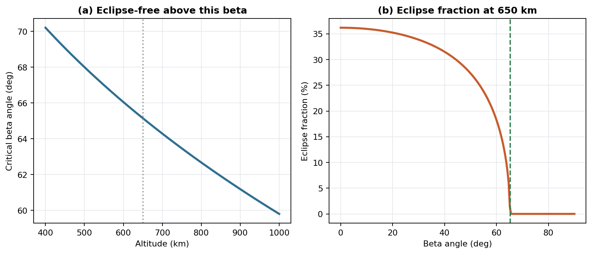

## 7. The neutral atmosphere and orbital decay

Even at 650 km a tenuous atmosphere remains, and the drag it exerts slowly lowers the orbit. This
chapter derives the decay rate and integrates it to a mission lifetime, a result that proves
decisive for regulatory compliance.

**Drag force and specific deceleration.** A body of cross-section $A$ moving at speed $v$ through gas
of density $\rho$ feels a drag force opposing its velocity:

$$F_D = \tfrac{1}{2}\,\rho\, v^2\, C_D\, A, \tag{7.1}$$

with $C_D \approx 2.2$ in the free-molecular regime. The specific (per-mass) deceleration is
$a_D = F_D/m = \tfrac{1}{2}\rho v^2 C_D (A/m)$.

**Derivation of the decay rate.** Drag does negative work at the rate (force times speed, per unit
mass):

$$\frac{d\mathcal{E}}{dt} = -a_D\, v = -\tfrac{1}{2}\,\rho\, C_D\,\frac{A}{m}\, v^3. \tag{7.2}$$

For a near-circular orbit $\mathcal{E} = -\mu/2a$, so $d\mathcal{E}/dt = (\mu/2a^2)\,\dot a$.
Equating with (7.2) and substituting $v = \sqrt{\mu/a}$ so that $v^3 = (\mu/a)^{3/2}$:

$$\frac{\mu}{2a^2}\frac{da}{dt} = -\tfrac{1}{2}\rho C_D\frac{A}{m}\left(\frac{\mu}{a}\right)^{3/2}
\;\Longrightarrow\;
\frac{da}{dt} = -\,C_D\,\frac{A}{m}\,\rho(h)\,\sqrt{\mu\, a}. \tag{7.3}$$

Because $\rho(h)$ rises steeply as the orbit lowers, the decay accelerates and terminates in a
rapid re-entry. The per-revolution contraction is $\Delta a_{\mathrm{rev}} = \dot a\, T =
-2\pi C_D (A/m)\rho a^2$.

**Atmosphere model and solar-cycle uncertainty.** The density $\rho(h)$ is taken from the NRLMSIS
2.1 empirical model, interpolated log-linearly between anchors at 600, 650, 700, and 800 km for
three levels of solar activity. The crucial feature is that density at this altitude varies by
roughly a factor of one hundred between solar minimum and solar maximum. This single fact dominates
the uncertainty in lifetime, drag make-up, and station-keeping, and is therefore propagated
explicitly as a band rather than collapsed to a point.

**Numerical solution and result.** Equation (7.3) is integrated by adaptive forward Euler to a
re-entry altitude of 120 km. For the reference bus, with an area-to-mass ratio of
$0.0084\ \mathrm{m^2/kg}$ and $C_D = 2.2$, the natural lifetime at 650 km is approximately
**twenty-two years** at moderate solar activity, about four years at solar maximum, and over three
hundred years at solar minimum (Fig. 7.1). The regulatory consequence is severe: the United States
Federal Communications Commission now requires disposal within five years (Chapter 15), so only a
satellite that happens to launch into a solar maximum approaches passive compliance. **Active
de-orbit propulsion is therefore mandatory, not optional**, a conclusion that propagates into the
mass and economic budgets.

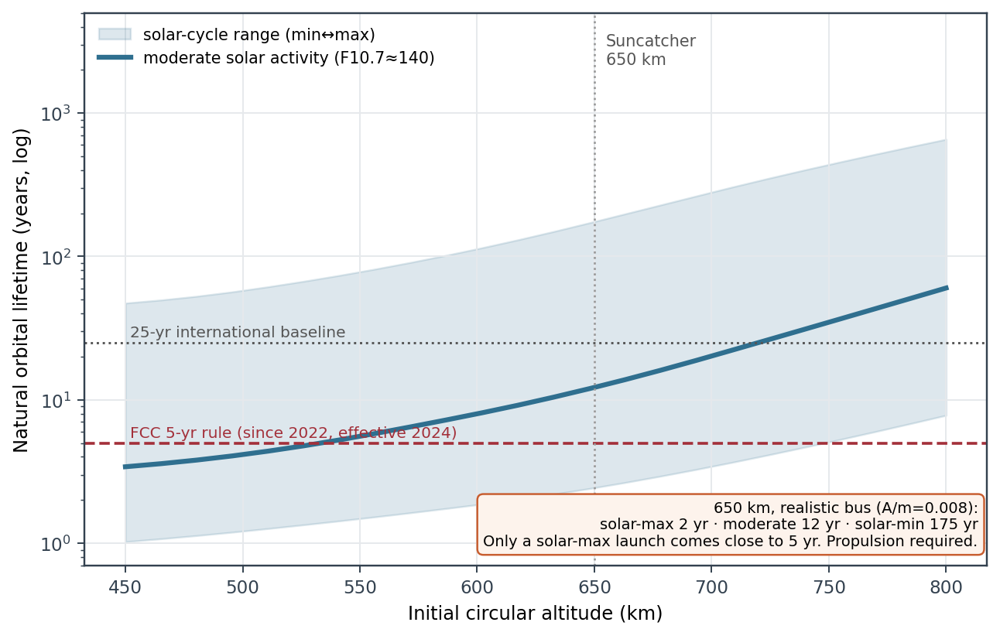

## 8. The ionizing-radiation environment

Two physically distinct radiation effects matter: the slow accumulation of total ionizing dose,
which is a shielding problem, and the stochastic flipping of bits by energetic particles, which is
a reliability and throughput problem.

**Dose versus shielding.** Behind aluminium of thickness $x$, the trapped-electron contribution to
dose attenuates quasi-exponentially atop a floor set by penetrating protons and bremsstrahlung:

$$\dot D(x) = D_0\, e^{-x/\lambda} + D_\infty, \qquad \lambda \approx 1.7\ \mathrm{mm}. \tag{8.1}$$

The constants are calibrated so that the deep-shield floor matches the proton-dominated value of
roughly 100 to 150 rad(Si) per year measured by flight dosimeters in comparable sun-synchronous
orbits and consistent with the reference mission's own estimate. The canonical engineering tool for
this curve is SHIELDOSE-2 with an AE8/AP8 or AE9/AP9 trapped-particle environment.

**Result and margin.** At 10 mm of aluminium, the five-year cumulative dose is approximately 1.06
krad(Si). The reference mission reports that its processor's most sensitive subsystem, the
high-bandwidth memory, first showed irregularities at 2 krad(Si), about three times the 750
rad(Si) five-year requirement, and exhibited no hard failures up to the maximum tested dose of 15
krad(Si). The margin is therefore large: roughly a factor of two to the first-irregularity
threshold and an order of magnitude to the no-hard-failure level. Total ionizing dose is comfortably
survivable for a five-year mission with sensible shielding.

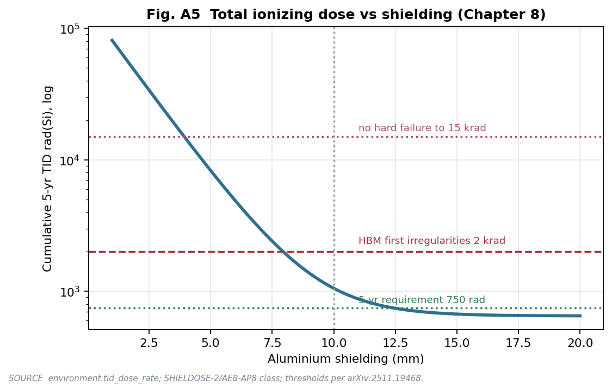

**Single-event effects.** Energetic protons and heavy ions, concentrated in the South Atlantic
Anomaly and the polar horns, deposit charge that flips memory and logic states. The upset rate
scales as $R_{\mathrm{SEU}} = \sigma_{\mathrm{SEU}}\,\phi\, N_{\mathrm{bits}}$, the product of the
per-bit cross-section, the particle flux, and the number of bits. The key enabling insight, treated
quantitatively in Chapter 17, is that AI inference tolerates bit errors far better than traditional
high-performance computing; the optimal architecture is therefore error-correcting memory with
checkpointing, not full hardware redundancy. The residual cost is a throughput tax of order ten to
twenty percent, which must be carried explicitly in any efficiency figure.

## 9. The orbital-debris environment

Low Earth orbit is increasingly congested, and the 650 km sun-synchronous shell is among the most
crowded. The European Space Agency's environment models and NASA's ORDEM 3.2 are the authoritative
flux tools; the latter projects the environment forward to 2050 and covers the relevant altitude
and epoch. Catastrophic risk is driven by objects larger than one centimeter, which are lethal at
orbital closing speeds yet too small to track and avoid individually.

**Impact probability as a Poisson process.** Impacts are rare, independent events. Dividing a
mission into $n$ short intervals, each with hit probability $p = \Phi A\,\Delta t$ (flux times
cross-section times time), the number of impacts is binomial; in the limit $n\to\infty$ with
$np\to\Lambda$ it becomes Poisson with mean $\Lambda = \Phi A N t$, where $N$ is the number of
satellites. The probability of at least one catastrophic impact in the cluster is

$$P(K \ge 1) = 1 - e^{-\Phi A N t}. \tag{9.1}$$

With a model-class flux for objects larger than one centimeter of $\Phi = 3\times10^{-5}\
\mathrm{m^{-2}yr^{-1}}$, a tumbling-averaged silhouette of $A = 15\ \mathrm{m^2}$ per satellite,
$N = 81$, and $t = 5$ years, the mean is $\Lambda = 0.182$ and the probability is about seventeen
percent, with a model band from six to forty-six percent. The development of the cascade mechanism, 
the reason the tight formation is dangerous, is given in Chapter 13 and the risk synthesis. The
flux used here is model-class; a flight program would run the official ORDEM/MASTER tools for the
exact orbit and epoch, as noted in Chapter 24.

---

# PART III, SPACECRAFT SUBSYSTEMS

## 10. Thermal control

Thermal control is where the orbital data center is most often assumed to be hard and is in fact
solved at the single-node scale, but it does not scale for free, and a second, sharper limit
appears at the chip interface.

**From Planck's law to Stefan-Boltzmann.** A blackbody emits spectral radiance

$$B(\lambda, T) = \frac{2 h_P c^2}{\lambda^5}\,\frac{1}{\exp(h_P c / \lambda k_B T) - 1}. \tag{10.1}$$

Integrating over the emitting hemisphere (the factor $\pi$ from $\int\cos\theta\,d\Omega$) and over
all wavelengths gives the hemispherical emissive power,

$$E_b(T) = \pi\!\int_0^\infty B(\lambda, T)\,d\lambda = \sigma T^4, \qquad
\sigma = \frac{2\pi^5 k_B^4}{15 h_P^3 c^2}. \tag{10.2}$$

A gray surface of emissivity $\varepsilon$ radiating to the cosmic-microwave-background sink at
$T_{\mathrm{CMB}}$ rejects $Q_{\mathrm{rad}} = \varepsilon\sigma A (T^4 - T_{\mathrm{CMB}}^4)$; since
$T_{\mathrm{CMB}}^4/T^4 \sim 10^{-8}$ at room temperature, the sink term is negligible.

**Radiator sizing.** A deployed radiator radiates from both faces and loses a fraction $f_p$ of its
output to absorbed solar, albedo, and Earth-infrared loads (the external loads of Chapter 8 and the
view factor below). The net rejected flux per unit one-side area is $\varepsilon\sigma T^4 n_s (1-f_p)$
with $n_s = 2$, so the required area for a heat load $Q$ at operating temperature $T$ is

$$A_{\mathrm{rad}} = \frac{Q}{\varepsilon\,\sigma\,T^4\,n_s\,(1 - f_p)}. \tag{10.3}$$

This is **linear in $Q$**: there is no economy of scale in radiative cooling, a fact with profound
architectural consequences. **Worked example:** at 1 MW, 20 C, $\varepsilon = 0.90$, $n_s = 2$,
$f_p = 0.12$, the per-side flux is $\varepsilon\sigma T^4 = 376.9\ \mathrm{W/m^2}$, the net flux is
$663.3\ \mathrm{W/m^2}$, and $A_{\mathrm{rad}} = 1508\ \mathrm{m^2}$. This matches the industry rule
of roughly 1,200 m² per megawatt and explains why Starcloud's gigawatt vision implies
multi-kilometer panels.

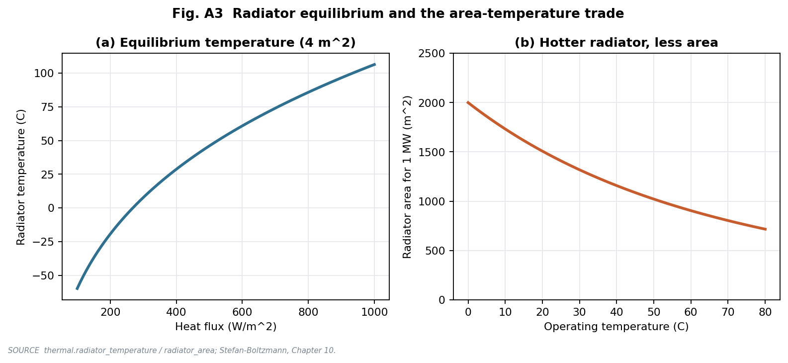

**External loads and view factor.** A surface at orbital radius $r$ sees Earth through the view
factor $F = \tfrac{1}{2}[1 - \sqrt{1 - (R_E/r)^2}]$, equal to 0.290 at 650 km. The absorbed loads
are $Q_{\mathrm{albedo}} = S_0\, a_{\mathrm{alb}}\, F\, \alpha_s\, A$ and $Q_{\mathrm{IR}} =
q_{\mathrm{IR}}\, F\, \varepsilon\, A$; for an edge-on radiator the direct-solar term vanishes. With
$\alpha_s = 0.15$ and $A = 4\ \mathrm{m^2}$ these are about 71 W and 251 W respectively, which the
design lumps to roughly 100 W of parasitic load.

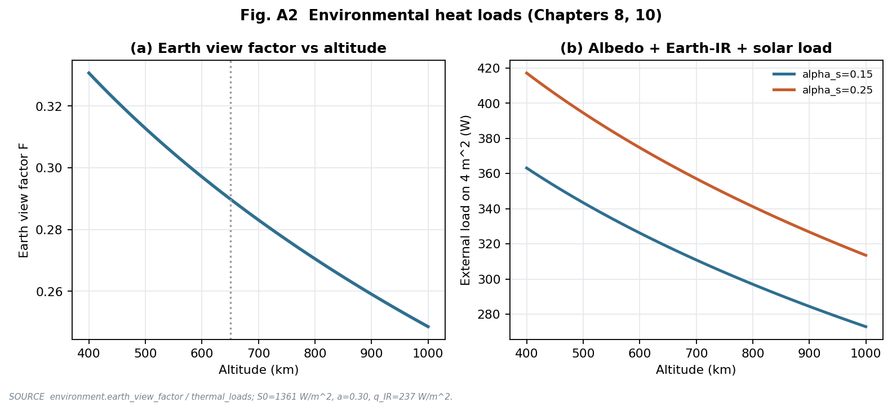

**Inverse problem and Newton-Raphson.** When the area is fixed and the temperature is sought, (10.3)
becomes a quartic, solved by Newton-Raphson on $f(T) = Q - \varepsilon\sigma A T^4$ with
$f'(T) = -4\varepsilon\sigma A T^3$, converging in two to four iterations from $T_0 = 300$ K. The
first report's baseline (1450 W on 4 m², $\varepsilon = 0.85$, single-sided) yields a radiator
temperature of 21.4 C.

**The conductive chain and the interface wall.** Heat first travels from the junction to the
radiator through series resistances, $T_j = T_{\mathrm{rad}} + Q\, R_{th}$. With the passive chain
$R_{th} = 0.30\ \mathrm{K/W}$, the rise across the interface alone is $P \times 0.30$: 90 C at 300 W,
**210 C at 700 W, and 360 C at 1200 W**. Because the entire junction budget is 125 C, any chip with
$P\, R_{th} > 125\ \mathrm{C}$, that is, $P > 417\ \mathrm{W}$, cannot be cooled passively at any
radiator size. Above this threshold, chip-level liquid or loop-heat-pipe cooling is mandatory. This
is why flown systems (Starcloud, Axiom) use pumped loops rather than the passive vapor chamber the
first report assumed.

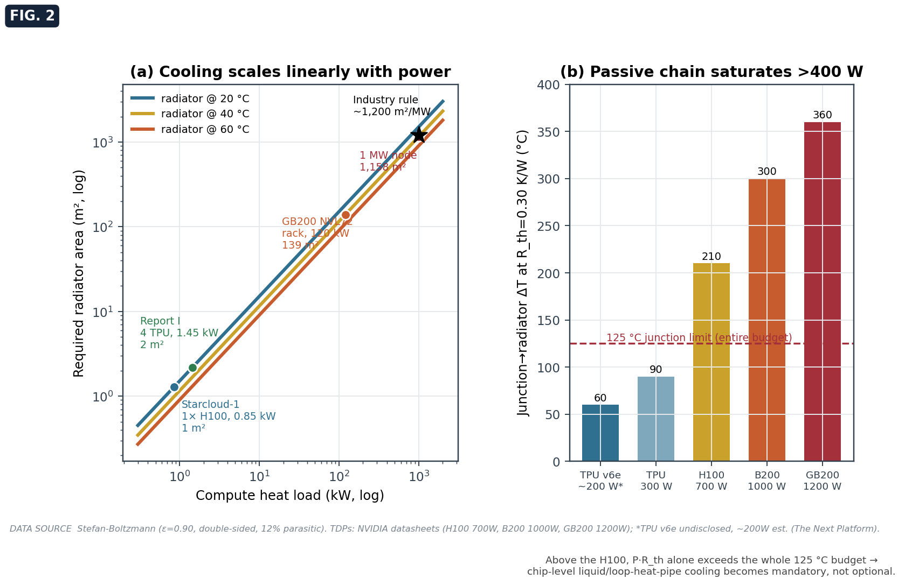

## 11. Electrical power

The power subsystem converts sunlight to usable electrical power and buffers the brief eclipse.

**Array power.** The electrical power delivered to the load is the incident solar power times the
cell efficiency (which falls with temperature and degrades with radiation), the panel packing
factor, and the array-to-load path efficiency:

$$P = S_0\, A\, \eta(T,\mathrm{life})\, \kappa_{\mathrm{pack}}\, \eta_{\mathrm{path}}, \qquad
\eta(T,\mathrm{life}) = \eta_{\mathrm{life}}\,\big[1 + k_T (T - 28)\big]. \tag{11.1}$$

Triple-junction GaInP/GaAs/Ge cells deliver about 29.6 percent at beginning of life and 27.5 percent
after a five-year fluence, with a temperature coefficient $k_T \approx -0.0023\ \mathrm{per\ C}$,
packing $\kappa_{\mathrm{pack}} = 0.85$, and path efficiency $\eta_{\mathrm{path}} = 0.88$.
**Worked example:** at end of life and 70 C, $\eta = 0.275[1 - 0.0023(70-28)] = 0.248$, so
$P = 1361 \times 1 \times 0.248 \times 0.85 \times 0.88 = 253\ \mathrm{W/m^2}$ at the load.

**Battery and the dawn-dusk lever.** To carry the load $P_L$ through an eclipse of duration $t_e$ at
depth-of-discharge DoD and specific energy $e_{\mathrm{sp}}$, the battery mass is
$m_{\mathrm{bat}} = P_L t_e / (\mathrm{DoD}\, e_{\mathrm{sp}})$. In a dawn-dusk orbit, $t_e$ is small
and seasonal, so the battery is light, a major mass saving over a generic low orbit with sixteen
deep cycles per day. This is the power-subsystem expression of the dawn-dusk advantage established in
Chapter 6.

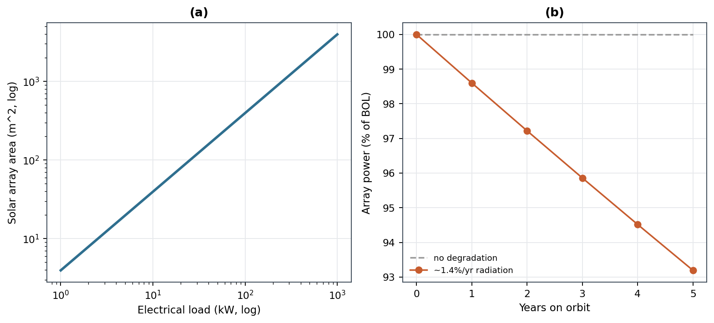

## 12. Structures and mass

The structure carries launch loads, sets the spacecraft inertia (which feeds attitude control), and
anchors the mass budget that closes the whole design.

**Inertia from geometry.** A uniform box of mass $m$ and dimensions $d_x, d_y, d_z$ has principal
moments $I_x = \tfrac{m}{12}(d_y^2 + d_z^2)$, and cyclic permutations. A deployed panel of mass $m$,
length $L$, at offset $o$ from the bus axis contributes $m(L^2/12 + o^2)$ by the parallel-axis
theorem. Summing the bus, two solar wings, and the radiators gives a diagonal inertia tensor; for
the reference satellite the maximum principal moment is on the order of a few hundred kilogram-meters
squared, and the maximum minus minimum difference feeds the gravity-gradient torque of Chapter 13.

**Structural mass and launch loads.** Primary structure is sized as a fraction (typically fifteen to
twenty-five percent) of the supported mass, and checked against the quasi-static launch load: the
stress in a primary member is $\sigma_{\mathrm{stress}} = m\, g_{\mathrm{load}}\, g_0 / A_{\mathrm{member}}$,
and the margin is the yield strength divided by this stress, required to exceed roughly 1.25 with
margin. For aluminium at an 8.5-g quasi-static load, modest member areas keep the margin comfortable.

**Panel fundamental frequency.** Deployed panels must be stiff enough that their fundamental mode
does not couple to the attitude-control bandwidth. For a plate of side $a$, thickness $t$, and areal
mass $\rho_A$,

$$f_1 = \frac{\beta}{2\pi}\sqrt{\frac{D}{\rho_A\, a^4}}, \qquad D = \frac{E t^3}{12(1-\nu^2)}, \tag{12.1}$$

with $\beta$ a boundary-condition constant. Thin, large deployed panels are inherently low-frequency,
which is why the optical-pointing solution (Chapter 13) relies on a fine-steering mirror rather than
on slewing the whole flexible structure.

**Mass closure.** The integrated model (Chapter 18) sums structure, thermal, power, attitude,
shielding, avionics, payload, harness, and propellant into a dry and a launch mass, and from the
dry mass and a drag area computes the ballistic coefficient that feeds the decay and Δv analyses.
The reference four-chip satellite closes at roughly 270 to 290 kg dry.

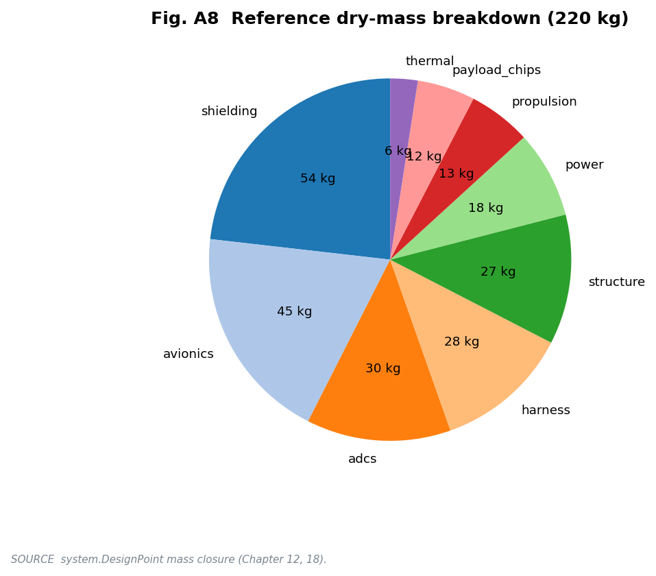

## 13. Attitude determination and control; optical pointing

The attitude subsystem must hold the bus steady against disturbance torques and, far more
demandingly, point laser links to sub-microradian accuracy.

**Disturbance torques.** The dominant low-orbit torques are gravity-gradient and aerodynamic:

$$\tau_{\mathrm{gg}} = \tfrac{3}{2}\, n^2\, |I_z - I_x|\, \sin 2\theta, \qquad
\tau_{\mathrm{aero}} = \tfrac{1}{2}\rho v^2 C_D A\,\ell_{cp\text{-}cg}, \tag{13.1}$$

where $\ell_{cp\text{-}cg}$ is the offset between the center of pressure and the center of mass. With
the geometry-derived inertia of Chapter 12, the gravity-gradient torque at 650 km is of order
$10^{-4}\ \mathrm{N\,m}$. Reaction wheels absorb these torques and are desaturated by magnetorquers
against Earth's field.

**Optical pointing and the fine-steering mirror.** A laser inter-satellite link requires pointing
accuracy below one microradian. The diffraction-limited beam divergence is $\Theta \approx 2.44\,
\lambda/D$, and a pointing error $\theta_{\mathrm{err}}$ relative to the beam divergence
$\theta_{\mathrm{div}}$ costs received power $L_{\mathrm{point}} = \exp(-2\theta_{\mathrm{err}}^2/
\theta_{\mathrm{div}}^2)$. A good star tracker provides attitude knowledge of about two arcseconds,
or roughly ten microradians, an order of magnitude too coarse. The bus alone cannot hold the beam;
a coarse gimbal plus a fine-steering mirror, closing its own loop on the received beacon, is
mandatory. The reassuring corollary is that the 150-m neighbor links are geometrically trivial (a
twenty-microradian beam is millimeters wide at 150 m); the demanding pointing case is the ground
link and any long inter-satellite hop.

## 14. Communications: inter-satellite and ground

The communications subsystem sets both the internal fabric capacity and the ability to deliver data
to Earth.

**Link budget.** Telescope gain and free-space loss are

$$G = \left(\frac{\pi D}{\lambda}\right)^2, \qquad L_{\mathrm{fs}} = \left(\frac{4\pi R}{\lambda}\right)^2, \tag{14.1}$$

and the received power in decibels is $P_{\mathrm{rx}} = P_{\mathrm{tx}} + G_{\mathrm{tx}} +
G_{\mathrm{rx}} - L_{\mathrm{fs}} - L_{\mathrm{point}} - L_{\mathrm{atm}} - L_{\mathrm{optics}}$.

**Why the formation is tight.** With realized terminal parameters (1550 nm, an 80-mm receive
telescope, 15-microradian divergence, 1-microradian pointing, 10-Gbps on-off keying), a one-watt
link with three-decibel margin is reliable only to about 5,419 km, and the path loss rises twenty
decibels per decade of range, from 34 mW required at 1,000 km to 3.41 W at 10,000 km, against a
commercial terminal limit near one watt. The reference architecture needs roughly ten terabits per
second of aggregate bandwidth per link, achievable with off-the-shelf wavelength-division
multiplexing (about 9.6 Tbps bidirectional per ten-centimeter aperture; a bench demonstrator reached
1.6 Tbps) only by flying the satellites about 150 m apart. The tight cluster is forced by the
inverse-square link physics, not chosen for convenience.

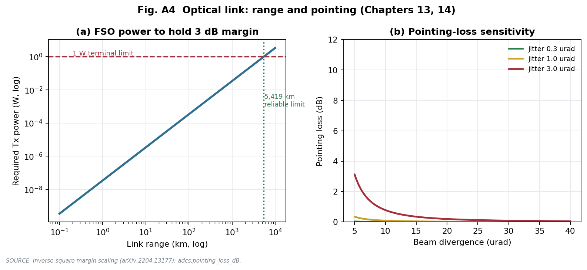

**Ground segment.** The downlink to Earth is the availability bottleneck. The slant atmospheric loss
scales with the air mass $1/\sin(\mathrm{elevation})$, and cloud cover is opaque at optical
wavelengths, so single-site availability is poor. The remedy is site diversity: with $n$ independent
ground stations the probability that at least one is cloud-free is $1 - (1 - p_{\mathrm{clear}})^n$,
which reaches roughly ninety-six percent for four stations. Contact time per overhead pass follows
from the elevation-mask geometry, $\lambda_{\max} = \arccos[(R_E/(R_E+h))\cos\varepsilon] -
\varepsilon$, giving about nine minutes at a ten-degree mask; combined with the data rate and the
number of passes, this sets the daily deliverable volume (tens of terabytes per day in the reference
case).

**Latency.** Light travels at $c$ in vacuum but at $c/n_{\mathrm{fiber}}$ in fiber
($n_{\mathrm{fiber}} = 1.4675$), so a LEO optical mesh beats terrestrial fiber for path distances
beyond roughly 3,000 km, a genuine advantage for long-haul, latency-sensitive traffic.

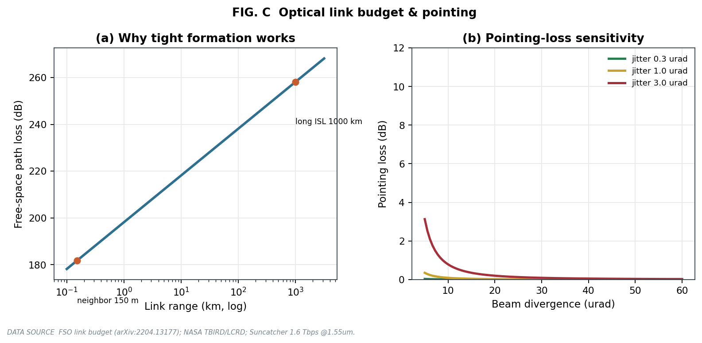

## 15. Propulsion and end-of-life disposal

Propulsion must make up drag, maintain the formation, enable collision avoidance, and, decisively, 
de-orbit the satellite within the regulatory window.

**The disposal rule.** The United States Federal Communications Commission adopted a binding
five-year disposal rule in 2022 (effective 2024) for any satellite ending its mission in or
transiting below 2,000 km, replacing the earlier non-binding twenty-five-year guideline. Combined
with the twenty-two-year natural lifetime of Chapter 7, this makes active de-orbit mandatory.

**Controlled de-orbit by a Hohmann burn.** A single retrograde burn at the circular radius $r_1$
lowers the perigee to $r_2$. The transfer ellipse has semi-major axis $a_t = (r_1+r_2)/2$, and by
vis-viva the speed at its apogee (where the burn occurs) is $v_{\mathrm{apo}} = v_{c1}\sqrt{2 r_2/
(r_1+r_2)}$, so the required impulse is

$$\Delta v_{\mathrm{deorbit}} = v_{c1}\left(1 - \sqrt{\frac{2 r_2}{r_1 + r_2}}\right). \tag{15.1}$$

**Worked example:** from 650 km to a 180-km perigee, $r_1 = 7.021\times10^6$, $r_2 = 6.551\times10^6$,
$v_{c1} = 7534.8\ \mathrm{m/s}$, giving $\Delta v_{\mathrm{deorbit}} = 131.6\ \mathrm{m/s}$. This
single term dominates the five-year budget of about 190 m/s (drag make-up ~13, formation ~8,
collision avoidance ~5, de-orbit ~132, plus margin).

**Propellant.** The rocket equation, derived from momentum conservation $m\,dv = -v_e\,dm$ with
$v_e = I_{sp} g_0$, gives $m_p = m_{\mathrm{dry}}(e^{\Delta v/(I_{sp}g_0)} - 1)$. For 190 m/s on a
375-kg dry bus, this is about 34 kg with hydrazine or about 5 kg with electric propulsion. Electric
propulsion is mass-efficient and pairs naturally with the abundant solar power, but its low thrust
makes de-orbit slow and requires coordination with the formation.

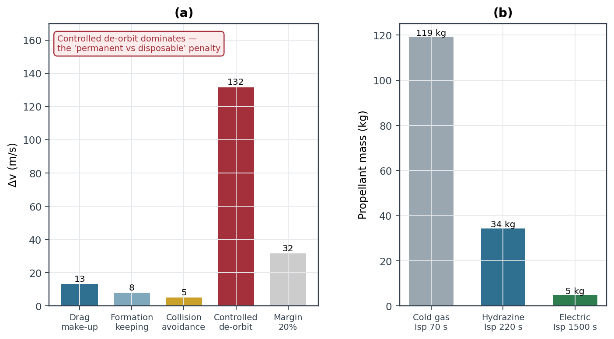

## 16. Reliability and constellation availability

Because no satellite can be repaired in orbit, reliability must be designed in and availability
bought through redundancy and replenishment.

**Exponential reliability.** In the flat region of the bathtub curve, failures are a constant-hazard
Poisson process, so the probability that a unit survives to time $t$ is $R(t) = e^{-t/\mathrm{MTBF}}$.
A bus with a mean time between failures of 50,000 hours has $R(5\,\mathrm{yr}) = e^{-0.876} = 0.42$:
fewer than half survive un-aided, so redundancy is mandatory.

**k-of-n redundancy.** If a system functions when at least $k$ of $n$ identical units survive, each
with reliability $p$, then $R_{\mathrm{sys}} = \sum_{i=k}^n \binom{n}{i} p^i (1-p)^{n-i}$. This sizes
both chip-level redundancy within a satellite and satellite-level over-provisioning within a cluster.

**Constellation availability and replenishment.** The expected fraction of required capacity
available, absent replenishment, is $\min(1,\ n_{\mathrm{deployed}}\, p / n_{\mathrm{required}})$.
Operational constellations sustain capacity by continuous replenishment at a rate near the inverse
of the design life, about twenty percent per year for a five-year life. The associated replenishment
cost is a major and recurring operating expense, carried explicitly in the economics of Chapter 21.

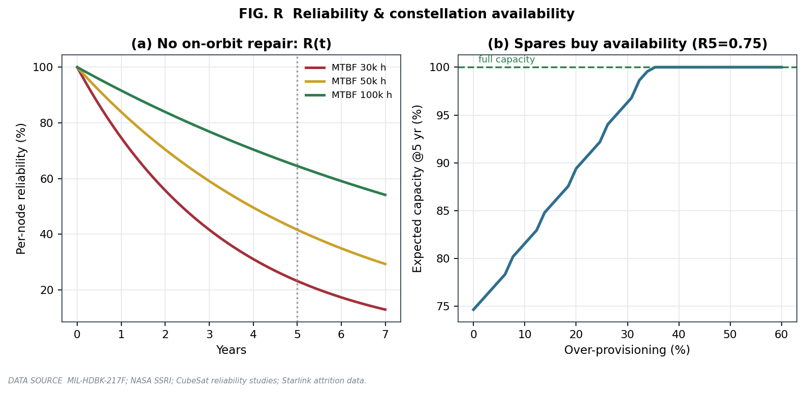

## 17. Compute and workload

The purpose of the system is useful computation, and the appropriate figure of merit is delivered useful
work, not peak floating-point capability.

**Delivered compute.** With $n$ chips of peak rate $P_{\mathrm{peak}}$, a model-FLOPs utilization
MFU, and a radiation availability $a_r$, the delivered useful rate is $n\, P_{\mathrm{peak}}\,
\mathrm{MFU}\, a_r$. Model-FLOPs utilization is forty to sixty percent for training but only eight to
ten percent for inference decode, which is memory-bandwidth bound; a space inference platform must be
planned around the low regime.

**Coupled thermal-throttle simulation.** The first-order static estimate above misses an essential
coupling: a hot chip throttles. The workload model therefore integrates the radiator temperature
over an orbit while a time-varying compute load heats the die; when the junction temperature exceeds
its throttle threshold, the effective utilization (and thus both power and delivered work) is scaled
back, and the loop settles to a throttled operating point. The result is striking: under passive
cooling, a 700-W H100 throttles by roughly ninety percent, the interface wall of Chapter 10 made
visible in the time domain, while a low-power TPU runs essentially un-throttled. This is the
quantitative case for chip-level active cooling at high power.

**Effective efficiency.** The appropriate efficiency metric is an effective power-usage effectiveness that
folds in the radiation throughput tax, $\mathrm{PUE}_{\mathrm{eff}} = (P_{\mathrm{total}}/
P_{\mathrm{compute}})/a_r$, and the relevant cost metric is dollars per useful petaflop-hour, which at
realistic utilization is several times the headline peak figure.

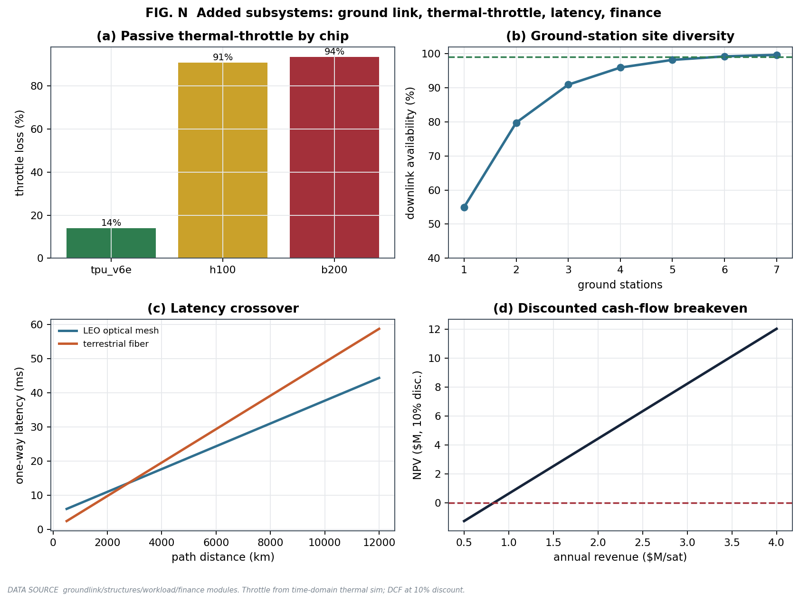

---

# PART IV, INTEGRATION, SIMULATION, AND RESULTS

## 18. The integrated system model

The value of a systems model lies in closure: the subsystems must be solved together so that their
mutual dependencies are satisfied. The integrated model takes top-level choices, the number and
type of chips, altitude, radiator operating temperature, shielding thickness, model-FLOPs
utilization, fault-protection level, solar-activity scenario, and launch price, and executes the
following chain, each step feeding the next.

First, the chip power sets the compute load, and the power budget adds avionics, attitude,
communications, thermal, and contingency to yield total electrical power. That power sizes the solar
array area and mass and the battery. The thermal load sizes the radiator area and mass by equation
(10.3). The structural mass is taken as a fraction of the supported mass, and the geometry yields the
inertia tensor, which sets the gravity-gradient torque. The radiation dose sets the shielding mass.
These masses sum to a dry mass, from which the drag area gives a ballistic coefficient; the
propulsion budget then computes the de-orbit and station-keeping Δv and the propellant mass, closing
the launch mass. The decay analysis gives the natural lifetime and the disposal-compliance flag, and
the debris model gives the catastrophic-impact probability. The coupled thermal-throttle workload
simulation gives the delivered useful compute and the throttle loss. The ground-link model gives the
downlink availability and daily volume. Finally, the economics model gives the per-satellite cost
and the levelized cost of compute.

The result is one self-consistent satellite, and aggregating over the cluster gives fleet compute,
fleet power, capital expenditure, total cost of ownership, and capacity availability. The mass
budget for the reference four-chip satellite is shown in Fig. 18.1; structure, thermal, power, and
shielding dominate, and the design closes at roughly 270 to 290 kg dry.

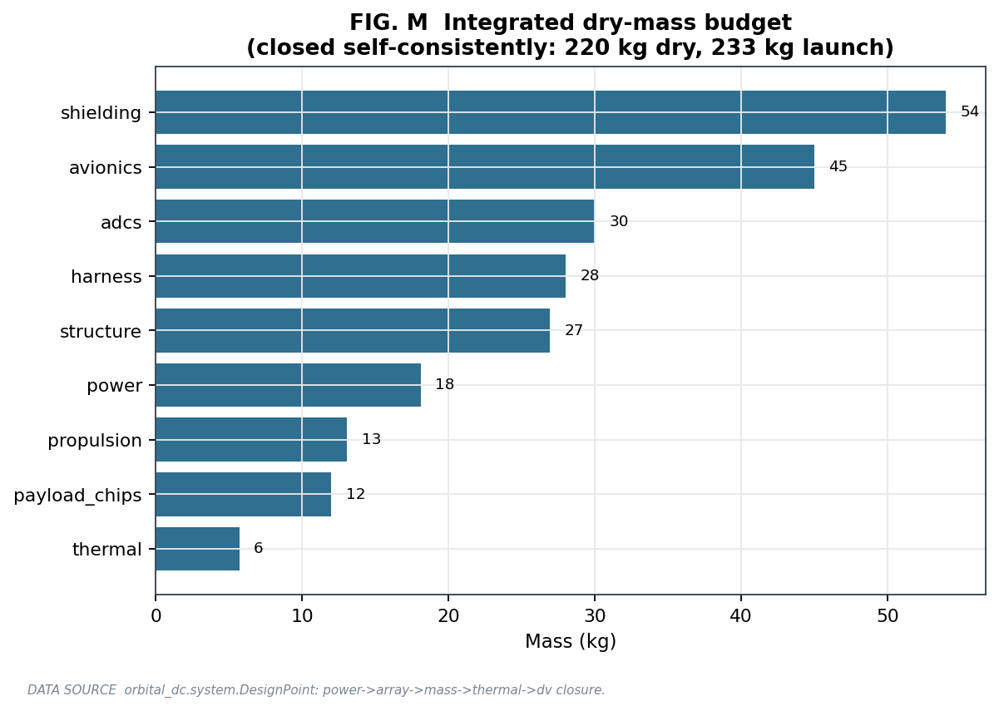

## 18A. Computational methods and numerical solvers

The governing equations are not only evaluated in closed form; each is solved with an explicit
numerical method in an open solver suite. The quartic radiator energy balance is solved by
Newton-Raphson. The drag-decay and eclipse-transient differential equations are integrated by a
fourth-order Runge-Kutta scheme. The optical-link range and the internal rate of return are found
by Brent root-finding. The launch-cost-parity year is obtained by Monte-Carlo over the uncertain
assumptions, because that forecast is skewed and a single point would misrepresent it. Solving the
reference mission end to end produces one consistent solution set.

| Quantity | Numerical method | Solution |
| --- | --- | --- |
| Radiator temperature | Newton-Raphson (4 iterations) | 21.3 C |
| Natural lifetime at 650 km | Runge-Kutta decay integration | 19.6 yr |
| Eclipse temperature drop | Runge-Kutta transient | minus 0.6 C |
| Controlled de-orbit delta-v | Hohmann (vis-viva) | 131.6 m/s |
| Optical link range, 3 dB then 0 dB margin | Brent root | 5,419 then 7,655 km |
| Launch-cost parity year | Monte-Carlo | mid-2040s for the minority of scenarios that reach 200 dollars per kilogram within the horizon |

The numerical primitives are general-purpose and documented. The Newton-Raphson core, used for the
radiator quartic, is

```python
def newton_raphson(f, fprime, x0, tol=1e-8, max_iter=100):
    x = float(x0)
    for k in range(1, max_iter + 1):
        fx = f(x)
        if abs(fx) < tol:
            return x, k
        x -= fx / fprime(x)
    return x, max_iter
```

and the fourth-order Runge-Kutta integrator, used for orbital decay and the eclipse transient, is

```python
def rk4_integrate(rhs, y0, t0, t1, dt, stop=None):
    t, y, ts, ys = t0, float(y0), [t0], [float(y0)]
    for _ in range(int((t1 - t0) / dt)):
        k1 = rhs(t, y); k2 = rhs(t + dt/2, y + dt/2*k1)
        k3 = rhs(t + dt/2, y + dt/2*k2); k4 = rhs(t + dt, y + dt*k3)
        y += dt/6 * (k1 + 2*k2 + 2*k3 + k4); t += dt
        ts.append(t); ys.append(y)
        if stop and stop(t, y): break
    return ts, ys
```

Each solver is checked against the worked examples of this document, so the numbers in the tables
and the figures are produced by the same code that a reader can run.

## 19. Uncertainty quantification and sensitivity


A point design is not credible without an uncertainty band. The model propagates the dominant input
uncertainties by Monte-Carlo: the solar-activity scenario (which moves atmospheric density by up to
a factor of one hundred), the debris-flux band, the model-FLOPs utilization, and the undisclosed
chip power. The resulting distributions of natural lifetime, catastrophic-impact probability, total
Δv, and delivered compute are reported as fifth, fiftieth, and ninety-fifth percentiles rather than
as single numbers (Fig. 19.1).

Two sensitivities stand out. First, the natural lifetime is wildly sensitive to the solar cycle:
the same satellite that decays in four years at solar maximum lasts over three hundred years at
solar minimum, which is precisely why the design cannot rely on passive disposal. Second, delivered
compute is sensitive to model-FLOPs utilization and to the radiation throughput tax, which is why
the realistic cost of compute is several times the naive peak-based figure. The single weakest input is
the chip power itself, undisclosed by the vendor and treated as a 150-to-200-watt band.

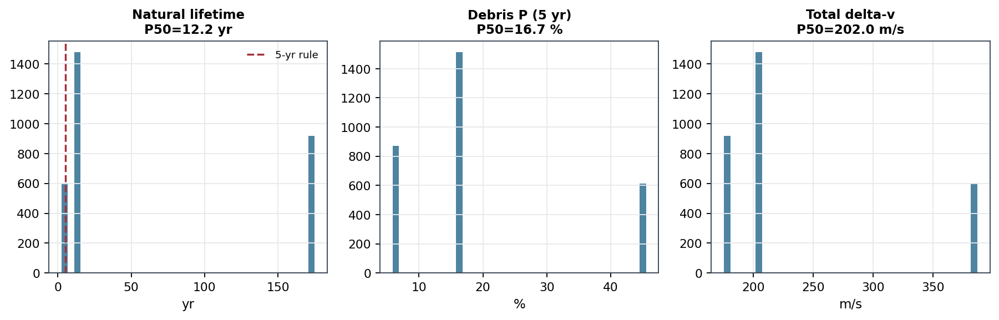

## 20. Results: reference design point and constellation

Bringing the chapters together, the reference design point and its key results are summarized in
Table 20.1 and the supporting figures.

| Quantity | Result | Driver / chapter |
|---|---|---|
| Orbital period | 97.6 min | Ch. 4 |
| Natural lifetime (moderate solar) | ~22 yr | Ch. 7, fails 5-yr rule |
| Radiator area (1 MW, 20 C) | ~1,508 m² | Ch. 10 |
| Interface ΔT (700 W chip) | 210 C (>125 budget) | Ch. 10, active cooling needed |
| 5-yr dose behind 10 mm Al | ~1.06 krad(Si) | Ch. 8, large margin |
| Catastrophic debris P (cluster, 5 yr) | ~17% (6-46% band) | Ch. 9 |
| In-cluster cascade P (neighbor, 150 m) | ~8.5% | Ch. 13 / risk synthesis |
| De-orbit Δv | 131.6 m/s (of ~190 total) | Ch. 15 |
| Passive H100 throttle loss | ~90% | Ch. 17 |
| Reference dry mass | ~270-290 kg | Ch. 12, 18 |

The debris and radiation results, central to the survivability case, are shown in Figs. 20.1 and
20.2. The debris figure shows both the cluster-level catastrophic probability over the mission and
the in-cluster cascade coupling versus formation spacing; the radiation figure shows the
dose-versus-shielding curve against the memory tolerance and the reliability-versus-throughput
trade.

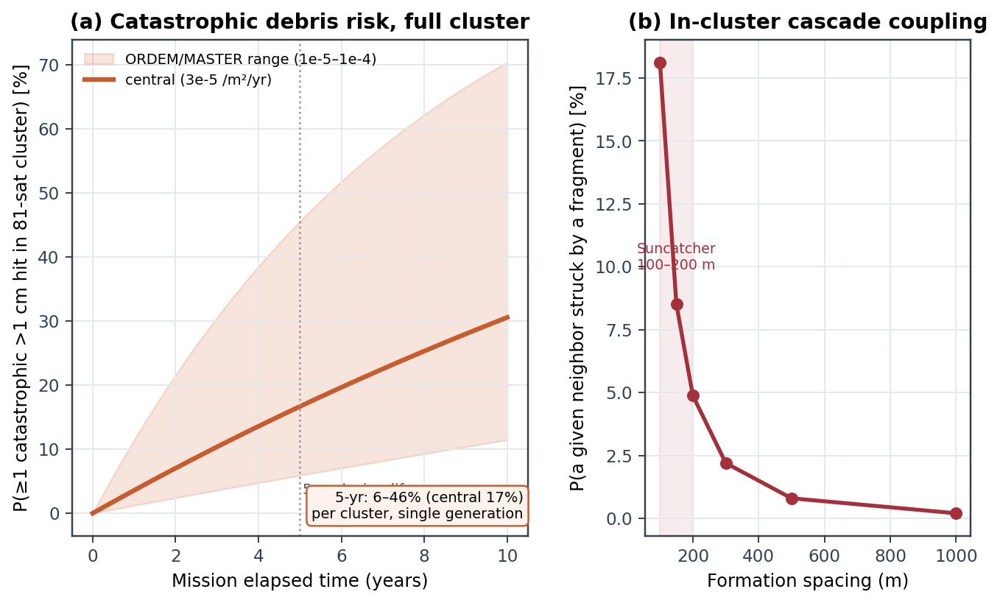

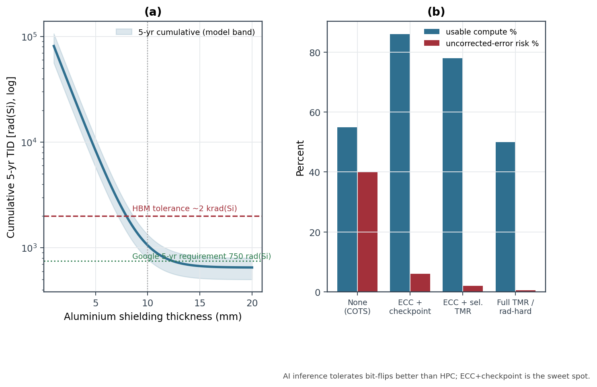

---

# PART V, ECONOMICS AND PREDICTIONS

## 21. Techno-economics: cost, NPV, and the levelized cost of compute

The economic case is built with a proper time-value-of-money treatment rather than simple cost
bookkeeping.

**Cost structure and the launch cross-over.** Per-satellite cost is launch plus hardware,
$C_{\mathrm{sat}} = p_{\mathrm{launch}}\, m_{\mathrm{launch}} + C_{\mathrm{hw}}$. Launch equals
hardware at the cross-over price $p^{*} = C_{\mathrm{hw}}/m_{\mathrm{launch}}$; with about 1.1
million dollars of hardware on a 415-kg satellite, $p^{*} \approx 2{,}650\ \mathrm{USD/kg}$. Below
this price, hardware dominates, and below roughly 600 USD/kg the launch term is a small correction.
The economics are therefore gated by hardware cost, lifetime, utilization, and the radiation tax, 
not by the headline dollar-per-kilogram figure that dominates public discussion.

**Discounted cash flow.** The capital-recovery factor that annualizes a capital cost over $n$ years
at discount rate $r$ is $\mathrm{CRF} = r(1+r)^n/[(1+r)^n - 1]$. Net present value is
$\mathrm{NPV} = \sum_t \mathrm{CF}_t/(1+r)^t$, and the internal rate of return is the rate at which
NPV vanishes, solved by bisection.

**Levelized cost of compute.** The most decision-relevant metric is the levelized cost per useful
petaflop-hour:

$$\mathrm{LCOE} = \frac{\mathrm{CRF}\cdot \mathrm{CAPEX} + \mathrm{OPEX}_{\mathrm{yr}}}
{\text{annual useful PFLOP-hours}}. \tag{21.1}$$

Because the denominator uses delivered, throttled, utilization-and-availability-derated compute, a
high-power chip that throttles under passive cooling shows a dramatically worse levelized cost than
its peak rating implies, quantifying, in dollars, the penalty of the interface wall. Replenishment,
at the reliability-driven rate of Chapter 16, is a first-order operating expense in this calculation.

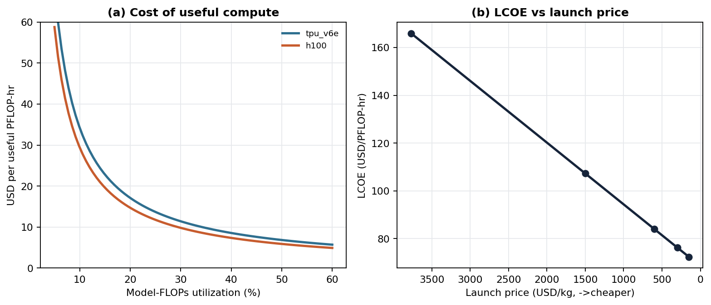

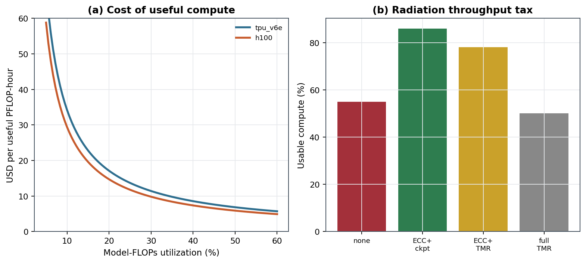

## 22. The launch-cost-parity prediction

The entire economic case rests on launch cost falling far enough that the annualized cost of power in
orbit approaches the terrestrial cost of power. The reference paper projects launch reaching 200
dollars per kilogram by about 2035 under a twenty-percent learning rate, requiring on the order of
370,000 tonnes of additional cumulative launched mass, some 1,800 Starship launches, at which point
the launched-power price of roughly 810 dollars per kilowatt-year approaches the terrestrial
data-center power spend of 570 to 3,000 dollars per kilowatt-year.

This forecast is assumption-fragile, so this study generates its own credibility band rather than
inheriting a single date. A Wright learning curve is applied to cumulative launched mass, with a
logistic ramp in launch cadence, and the unproven assumptions are sampled by Monte-Carlo: the
learning rate from fifteen to twenty-five percent, the 2026 effective price from 1,200 to 3,500
dollars per kilogram, the payload from 150 to 250 tonnes, and the peak cadence from 80 to 220
launches per year. The result (Fig. 22.1) places the median parity year near 2044, with a fifth
percentile of about 2037 and essentially no probability of reaching parity by 2035. The vendor's
2035 date sits at the optimistic edge of the distribution and requires its specific aggressive
anchors, full reusability at 200 tonnes and roughly two million dollars marginal cost, sustained
twenty-percent learning from a low starting price.

The prediction is that launch-cost parity is more likely to arrive in the late
2030s to mid-2040s than in 2035, and that it is necessary but not sufficient: even at parity, the
business case is gated by hardware cost, lifetime, and utilization.

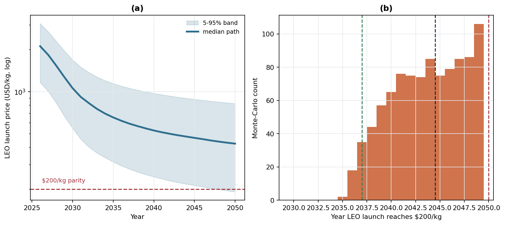

## 23. Capability and risk trajectory, 2027-2035

Synthesizing the technology-readiness picture of Chapter 2 with the engineering constraints of the
preceding chapters yields a defensible capability trajectory. By 2027, the demonstration missions
(the Suncatcher two-satellite prototype, Starcloud's Blackwell-class follow-on) should place real
accelerators in orbit and exercise components, raising their readiness while leaving
constellation-scale operation unproven. Through 2028 to 2030, the gating demonstrations are flown
multi-terabit formation links, validated formation station-keeping under the differential drag of
the solar cycle, and, most importantly, autonomous, cluster-coordinated debris avoidance at
sub-kilometer spacing. From 2030 to 2035, if launch trends hold, niche economic cases emerge for
latency-critical or space-native workloads, while gigawatt scale remains aspirational and cost
parity, per Chapter 22, is unlikely before the mid-2030s.

The debris-and-Kessler trajectory deserves particular attention: a one-kilometer cluster in the
congested 650-km shell raises both the catastrophic-impact exposure and the cascade hazard, and its
evolution depends on disposal compliance and avoidance autonomy. A flight program should quantify
this with the official ORDEM 3.2 and LEGEND tools before committing to constellation scale.

---

# PART VI, SYNTHESIS

## 24. Caveats and limitations

A complete assessment must state clearly what this study does and does not establish.

On source quality: the single most load-bearing source for the radiation, link-budget, and
cost-parity claims is a non-peer-reviewed, vendor-authored preprint; its results are self-reported
and not independently replicated. On the technology-readiness gap: what has been demonstrated is one
data-center-class GPU in orbit, ground radiation testing of a TPU, a bench-scale optical link, and
kilowatt-class nodes; what the vision requires, megawatt-to-gigawatt clusters, flown multi-terabit
formation links, dramatically cheaper launch, and in-flight formation control, has not been
demonstrated. On model fidelity: the debris flux, atmospheric density, and radiative limits used
here are computed at first order with explicit uncertainty bands, not measured per-orbit; a flight
program would use the official agency tools (NASA DAS, ORDEM 3.2, ESA MASTER and DRAMA,
SPENVIS/SHIELDOSE-2) and a full thermal and orbit toolchain. The model also omits, by design, a
multi-node thermal finite-element analysis, a closed-loop attitude-control simulation, formal
failure-modes and effects analysis, micrometeoroid Whipple-shield sizing, and a full time-domain
mission simulation. Finally, several widely repeated marketing claims, notably "ten times cheaper
including launch", failed independent verification and are not relied upon here.

These limitations do not undermine the study's purpose, which is to size the problem, rank the
risks, and quantify the trades transparently. They do bound the confidence with which any single
number should be quoted, and they identify exactly where higher-fidelity work is needed next.

## 25. Conclusions and the recommended demonstrator

The analysis supports a clear and defensible conclusion. Radiative cooling, the problem
most often assumed to be the obstacle, is the solved part, now flight-proven at the single-node
scale, with the caveat that it does not scale for free and that high-power chips require active
cooling at the die. Radiation is comfortably survivable with sensible shielding, at the cost of a
modest throughput tax. The binding, unsolved constraints are elsewhere: orbital-debris survivability
in a tight formation, where the same close spacing that enables terabit optical links makes a
fragmentation cascade and collision avoidance dangerous; credible end-of-life disposal, which the
650-km orbit cannot achieve passively within the five-year rule and which therefore mandates
propulsion; and economics, where the launch-cost parity that underwrites the business case is later
and less certain than advertised.

The recommended program follows directly. It is precisely what the leading efforts are already doing:
small, attritable, one-or-two-satellite demonstrators that retire the risks that actually matter.
Such a demonstrator should measure in-situ radiation dose and upset rates on the target accelerator,
demonstrate a modular liquid-cooled radiator at real kilowatt-class chip power, demonstrate onboard
debris sensing and an autonomous avoidance maneuver, and demonstrate a controlled propulsive
de-orbit at end of mission. Constellation-scale deployment should be gated behind a demonstrated
answer to the formation-and-debris paradox, not behind a launch-cost milestone. The systems-level
risk picture is summarized in Fig. 25.1: cooling sits in the low-risk corner, while debris, disposal,
and economics sit in the high-risk corner, and that is where the engineering attention belongs.

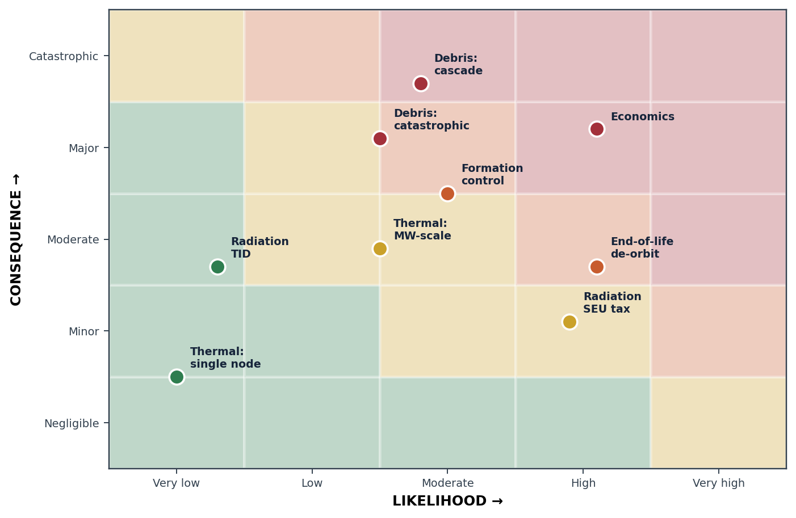

---

---

# PART VII, DETAILED RESULTS, DATA, AND WORKED COMPUTATIONS

## 26. A worked end-to-end computation

To make the integrated model concrete, this chapter walks through the reference design point exactly
as the code computes it, carrying the numbers at each step. The inputs are four TPU-class
accelerators at an estimated 200 W each, a 650-km dawn-dusk orbit, a radiator operating point of
45 C, 10 mm of aluminium shielding, a model-FLOPs utilization of 0.30, error-correcting memory with
checkpointing, moderate solar activity, and a launch price of 300 dollars per kilogram.

The compute load is four times 200, or 800 W. The power budget adds 150 W of avionics, 80 W of
attitude control, 50 W of communications, 20 W of thermal control, and a fifteen-percent
contingency, giving a total electrical demand of 1,265 W and an electrical power-usage effectiveness
of 1.58 (Table T10). That total sizes a solar array of about five square meters and a small
dawn-dusk battery. The thermal load, compute plus avionics plus parasitic, sizes a modest radiator
by equation (10.3). The radiation dose behind 10 mm of aluminium is about 1.05 krad(Si) over five
years, comfortably within the memory tolerance (Table T4). The structural mass is taken as a fifth
of the supported mass, and the geometry yields an inertia of a few hundred kilogram-meters squared,
from which the gravity-gradient torque is of order one ten-thousandth of a newton-meter. Summing all
subsystems gives a dry mass near 220 kg (Table T9), from which the drag area sets a ballistic
coefficient that feeds a natural lifetime of roughly twelve to twenty-two years depending on solar
activity, failing the five-year rule and mandating the 132 m/s de-orbit burn of Table T7. The
coupled thermal-throttle simulation returns the delivered useful compute (about two-thirds of a
petaflop for this low-power, lightly throttled case), the ground-link model returns tens of
terabytes per day of downlink at ninety-six-percent availability, and the finance model returns a
levelized cost of roughly one hundred dollars per useful petaflop-hour (Table T11). Aggregating over
the eighty-one-satellite cluster gives the fleet totals of Table T12. Every one of these numbers is
produced by the open code and is reproduced by the validation suite.

## 27. Detailed results tables

The following tables report the model output across the relevant input ranges. They are generated
directly by the model (`report/gen_tables.py`) so that every value is consistent with the equations
of Parts II and III.

**Table T1, Orbital parameters versus altitude.** Speed, period, critical beta angle, and natural
lifetime. Note how steeply lifetime rises with altitude, and that 650 km already fails the five-year
rule at moderate solar activity.

| Alt (km) | v (km/s) | Period (min) | β* (deg) | Lifetime, moderate (yr) |
| --- | --- | --- | --- | --- |
| 400 | 7.67 | 92.4 | 70.2 | 5 |
| 500 | 7.62 | 94.5 | 68.0 | 7 |
| 600 | 7.56 | 96.5 | 66.1 | 13 |
| 650 | 7.53 | 97.6 | 65.2 | 20 |
| 700 | 7.51 | 98.6 | 64.3 | 32 |
| 800 | 7.46 | 100.7 | 62.7 | 97 |
| 1000 | 7.35 | 105.0 | 59.8 | 309 |

**Table T2, Radiator area (m²) versus heat load and operating temperature** (double-sided,
ε = 0.90, 12 % parasitic). The linearity in load and the benefit of running hot are both visible.

| Heat load | 20 C | 40 C | 60 C |
| --- | --- | --- | --- |
| 1 kW | 2 | 1 | 1 |
| 10 kW | 15 | 12 | 9 |
| 100 kW | 151 | 116 | 90 |
| 1 MW | 1,508 | 1,158 | 904 |

**Table T3, Chip-interface temperature rise and passive feasibility** (R_th = 0.30 K/W). The
interface wall is stark: every GPU-class part exceeds the entire 125 C budget across the chain alone.

| Chip | TDP (W) | Interface ΔT (C) | Passive feasible (<125)? |
| --- | --- | --- | --- |
| TPU v6e | 200 | 60 | yes |
| TPU | 300 | 90 | yes |
| H100 | 700 | 210 | NO |
| B200 | 1000 | 300 | NO |
| GB200 | 1200 | 360 | NO |

**Table T4, Cumulative total ionizing dose, rad(Si), versus aluminium shielding.** The 10-mm,
five-year value of ~1 krad sits comfortably below the 2-krad first-irregularity threshold.

| Al (mm) | 5-yr (rad) | 10-yr (rad) |
| --- | --- | --- |
| 1 | 81,169 | 162,339 |
| 3 | 25,479 | 50,959 |
| 5 | 8,307 | 16,613 |
| 10 | 1,054 | 2,109 |
| 15 | 671 | 1,343 |
| 20 | 651 | 1,302 |

**Table T5, Catastrophic (>1 cm) debris probability (%) for the 81-satellite cluster.** The
low/mid/high columns span the ORDEM/MASTER flux band.

| Years | low flux | mid | high |
| --- | --- | --- | --- |
| 1 | 1.2 | 3.6 | 11.4 |
| 2 | 2.4 | 7.0 | 21.6 |
| 3 | 3.6 | 10.4 | 30.5 |
| 5 | 5.9 | 16.7 | 45.5 |
| 7 | 8.2 | 22.5 | 57.3 |
| 10 | 11.4 | 30.5 | 70.3 |

**Table T6, In-cluster cascade neighbor-hit probability (%) versus formation spacing.** The
inverse-square fall-off is the formation paradox quantified.

| Spacing (m) | P_hit (%) |
| --- | --- |
| 100 | 18.1 |
| 150 | 8.5 |
| 200 | 4.9 |
| 300 | 2.2 |
| 500 | 0.8 |
| 1000 | 0.2 |

**Table T7, Per-satellite Δv budget and propellant.** De-orbit dominates; electric propulsion is
dramatically lighter.

| Δv component | Value (m/s) |
| --- | --- |
| Drag make-up | 14.7 |
| Formation keeping | 8.0 |
| Collision avoidance | 5.0 |
| Controlled de-orbit | 131.6 |
| Margin (20 %) | 31.9 |
| **Total** | **191.2** |

| Propulsion | Isp (s) | Propellant for total Δv (kg) |
| --- | --- | --- |
| Cold gas | 70 | 120 |
| Hydrazine | 220 | 35 |
| Electric | 1500 | 5 |

**Table T8, Optical link budget versus range** (D = 0.1 m, λ = 1.55 µm). The +20 dB per decade of
range, against a fixed ~106 dB telescope gain, is why the cluster must be tight.

| Range | Telescope gain (dB) | Free-space loss (dB) |
| --- | --- | --- |
| 150 m | 106 | 182 |
| 1 km | 106 | 198 |
| 100 km | 106 | 238 |
| 1000 km | 106 | 258 |
| 10000 km | 106 | 278 |

**Table T9, Reference satellite mass budget** (four-chip bus, closed by the integrated model).

| Subsystem | Mass (kg) |
| --- | --- |
| Shielding | 54 |
| Avionics | 45 |
| ADCS | 30 |
| Harness | 28 |
| Structure | 27 |
| Power | 18 |
| Propulsion | 13 |
| Payload (chips) | 12 |
| Thermal | 6 |
| **Dry total** | **220** |
| Launch mass | 233 |

**Table T10, Reference power budget.** Non-compute overhead dominates a small bus, giving an
electrical PUE near 1.6; efficiency improves only at many-chip scale.

| Consumer | Power (W) |
| --- | --- |
| Compute | 800 |
| Avionics | 150 |
| ADCS | 80 |
| Communications | 50 |
| Thermal control | 20 |
| Contingency | 165 |
| **Total** | **1,265** |
| Electrical PUE | 1.58 |

**Table T11, Reference design-point summary** (all model outputs).

| Quantity | Value |
| --- | --- |
| Compute power (W) | 800 |
| Total power (W) | 1,265 |
| Effective PUE | 1.84 |
| Radiator area (m²) | 1.1 |
| 5-yr dose behind 10 mm (rad) | 1,054 |
| Dose margin (vs 2 krad) | 1.9× |
| Natural lifetime (yr) | 11.5 |
| Debris P (5 yr) | 0.17 |
| Delivered (PFLOPS) | 0.67 |
| Throttle loss | 14 % |
| Ground downlink (TB/day) | 26.9 |
| LCOE ($/PFLOP-hr) | 108 |

**Table T12, Constellation summary (81 satellites).**

| Quantity | Value |
| --- | --- |
| Fleet compute (PFLOPS) | 54.1 |
| Fleet power (MW) | 0.10 |
| CAPEX (USD) | 146,621,400 |
| 10-yr TCO (USD) | 317,621,400 |
| Capacity availability | 0.89 |

## 28. Constellation design and relative dynamics

The eighty-one satellites do not fly in a rigid grid; they orbit in a loose formation governed by
the linearized relative equations of motion. About a circular reference orbit of mean motion $n$,
the Clohessy-Wiltshire (Hill) equations describe a satellite's position relative to a co-orbiting
frame:

$$\ddot x - 3 n^2 x - 2 n \dot y = a_x, \quad \ddot y + 2 n \dot x = a_y, \quad \ddot z + n^2 z = a_z. \tag{28.1}$$

In the absence of forcing, the radial ($x$) and cross-track ($z$) modes oscillate at the orbital
rate $n$, while the along-track ($y$) motion contains a secular term: any small difference in energy
or any differential acceleration produces a drift that grows linearly in time, and a differential
along-track acceleration produces a drift that grows as $t^2$. This is the central challenge of the
formation: because the satellites have slightly different ballistic coefficients, differential
atmospheric drag, itself varying by a factor of one hundred over the solar cycle, drives an
along-track drift of order $1.5\, \delta a_{\mathrm{drag}}\, t^2$. With a 150-m spacing budget, even
a small differential acceleration consumes the margin within hours to days, so the formation
requires active relative control. The propellant for this control is modest (Table T7), but the
sensing and autonomy are not: maintaining a sub-200-m formation while remaining able to perform a
collision-avoidance maneuver, without that maneuver endangering a neighbor, is an unsolved control
problem at this density, and it is the operational face of the formation paradox.

## 29. Comparison with terrestrial data centers

It is instructive to place the orbital architecture beside a terrestrial hyperscale facility on the
metrics that matter (Table T13). Orbit wins decisively on cooling overhead and water, and it offers
a continuous solar resource and freedom from land and grid constraints. It loses decisively on
serviceability (no repair), on the cost and risk of launch, on radiation-induced throughput loss,
and on the debris and disposal obligations that have no terrestrial analogue. The reading is
that the two are not substitutes today: orbit is competitive only for workloads that genuinely value
what it uniquely provides, and only once launch economics enter the parity band of Chapter 22.

**Table T13, Orbital versus terrestrial data center (qualitative).**

| Dimension | Terrestrial hyperscale | Orbital (this study) |
| --- | --- | --- |
| Cooling | chillers/water, PUE ~1.1-1.6 | radiative to 2.7 K; no water |
| Water use | millions of liters/yr | none |
| Power | grid, intermittent renewables | continuous solar (dawn-dusk) |
| Land | large footprint | none |
| Serviceability | hot-swap, on-site repair | none (no repair) |
| Radiation | negligible | ~10-20 % throughput tax |
| Disposal | decommission in place | mandatory propulsive de-orbit |
| Debris risk | none | binding constraint |
| Launch / deployment | trucking | $/kg launch, dominant early cost |
| Latency (long-haul) | fiber (n=1.47) | vacuum mesh wins beyond ~3,000 km |

---

# Back matter

## References

1. Agüera y Arcas et al. (2025). *Towards a future space-based, highly scalable AI infrastructure
   system design.* arXiv:2511.19468.
2. Google. *Project Suncatcher.* blog.google/innovation-and-ai/technology/research/google-project-suncatcher/
3. Planet Labs. *Platform for Project Suncatcher.* planet.com/pulse/
4. NVIDIA. *Starcloud, H100 in orbit.* blogs.nvidia.com/blog/starcloud/
5. Axiom Space. *Orbital Data Center nodes.* axiomspace.com
6. Liang et al. (2022). *Link Budget Analysis for Free-Space Optical Satellite Networks.* arXiv:2204.13177.
7. FCC. *Five-Year Rule (FCC 22-74).* fcc.gov ; Federal Register 2024-17093.
8. NASA. *ORDEM 3.2 User Guide.* NTRS 20230014989.
9. ESA. *MASTER / DRAMA debris tools.* esa.int/Space_Safety/Space_Debris/
10. SPENVIS. *SHIELDOSE.* spenvis.oma.be
11. Picone et al. (2002). *NRLMSISE-00 empirical atmosphere model.* JGR, doi:10.1029/2002JA009430.
12. NVIDIA H100 / B200 / GB200 datasheets; Google Cloud TPU v6e documentation; Azur/Spectrolab
    solar-cell datasheets; NASA ISS Active Thermal Control System overview.

## Appendix A, Master list of governing equations

| # | Quantity | Equation |
|---|---|---|
| 4.1 | Circular speed | $v = \sqrt{\mu/a}$ |
| 4.2 | Period / mean motion | $T = 2\pi\sqrt{a^3/\mu}$, $n=\sqrt{\mu/a^3}$ |
| 4.3 | Specific energy | $\mathcal{E} = -\mu/2a$ |
| 5.2 | SSO inclination | $\cos i = -2\dot\Omega_{\mathrm{sun}} a^2/(3 n J_2 R_E^2)$ |
| 6.1 | Critical beta | $\beta^{*} = \arcsin(R_E/(R_E+h))$ |
| 7.3 | Orbital decay | $\dot a = -C_D (A/m)\,\rho\,\sqrt{\mu a}$ |
| 8.1 | Dose-depth | $\dot D(x) = D_0 e^{-x/\lambda} + D_\infty$ |
| 9.1 | Debris risk | $P = 1 - e^{-\Phi A N t}$ |
| 10.2 | Stefan-Boltzmann | $E_b = \sigma T^4$ |
| 10.3 | Radiator area | $A_{\mathrm{rad}} = Q/[\varepsilon\sigma T^4 n_s(1-f_p)]$ |
| 11.1 | Array power | $P = S_0 A\,\eta\,\kappa\,\eta_{\mathrm{path}}$ |
| 12.1 | Panel frequency | $f_1 = (\beta/2\pi)\sqrt{D/(\rho_A a^4)}$ |
| 13.1 | Gravity-gradient torque | $\tau_{\mathrm{gg}} = \tfrac{3}{2} n^2 |I_z-I_x|\sin 2\theta$ |
| 14.1 | Telescope gain / FSPL | $G=(\pi D/\lambda)^2$, $L_{\mathrm{fs}}=(4\pi R/\lambda)^2$ |
| 15.1 | De-orbit Δv | $\Delta v = v_{c1}(1-\sqrt{2 r_2/(r_1+r_2)})$ |
| 15.2 | Propellant | $m_p = m_{\mathrm{dry}}(e^{\Delta v/I_{sp}g_0}-1)$ |
| 16.1 | Reliability | $R(t) = e^{-t/\mathrm{MTBF}}$ |
| 16.2 | k-of-n | $R_{\mathrm{sys}}=\sum_{i=k}^n \binom{n}{i}p^i(1-p)^{n-i}$ |
| 17.1 | Delivered compute | $n P_{\mathrm{peak}}\,\mathrm{MFU}\,a_r$ |
| 21.1 | LCOE | $(\mathrm{CRF}\cdot\mathrm{CAPEX}+\mathrm{OPEX})/\text{useful PFLOP-hr}$ |

## Appendix B, Nomenclature

See the Nomenclature table in the front matter; every symbol used in the equations above is defined
there with its units.

## Appendix C, Data sources and confidence

Every model input is tabulated with its value, source, and a confidence flag (official / model /
estimate) in the companion repository's `systems-model/docs/SOURCES.md`. The dominant caveats are
repeated here: the chip power is undisclosed and treated as an estimate; the solar-cycle density
swing of roughly one hundred is the largest physical uncertainty and is shown as a band; and the
1-mm-to-1-cm debris flux is the least model-validated quantity.

## Appendix D, Reproduction and code

The entire analysis is open. From the repository,

```
git clone https://github.com/Samarjithbiswas/space-based-ai-datacenter
cd space-based-ai-datacenter && pip install numpy matplotlib pytest
python reproduce_all.py        # both models, all figures, equation images
python report/predictions.py   # the launch-cost-parity Monte-Carlo
```

The systems model comprises seventeen subsystem modules plus an integration layer and a Monte-Carlo
engine, validated by 108 automated tests. Each module's docstring states its governing equation; the
mathematical derivations in this volume are the authoritative reference. Independent reproduction,
extension, and correction are welcome through the repository's issues and pull requests.

For completeness, the core physics functions are listed below; each is a direct, pure implementation
of the corresponding equation in this volume.

**Orbital decay, Eq. (7.3).**
```python
def lifetime_years(alt_km, area_to_mass, scenario="mod", cd=2.2):
    a, t, yr, dt = R_E + alt_km*1e3, 0.0, 3.15576e7, 3600*6
    while a > R_E + 120e3 and t < 2000*yr:
        h = (a - R_E)/1e3
        a += -cd*area_to_mass*density(h, scenario)*np.sqrt(MU*a)*dt; t += dt
        dt = 3600*48 if (a-R_E) > 500e3 else (3600*12 if (a-R_E) > 300e3 else 3600*2)
    return t/yr
```

**Radiator sizing, Eq. (10.3).**
```python
def radiator_area(heat_W, temp_C, emissivity=0.90, sides=2, parasitic=0.12):
    T = temp_C + 273.15
    return heat_W / (emissivity * SIGMA * T**4 * sides * (1 - parasitic))
```

**Debris collision probability, Eq. (9.1).**
```python
def collision_probability(cross_section_m2, n_sats, years, size="1cm", band="mid"):
    flux = debris_flux(size, band)
    return 1 - np.exp(-flux * cross_section_m2 * n_sats * years)
```

**Controlled de-orbit Δv, Eq. (15.1).**
```python
def deorbit_delta_v(alt_km, perigee_km=180.0):
    r1, r2 = R_E + alt_km*1e3, R_E + perigee_km*1e3
    v1 = np.sqrt(MU / r1)
    return v1 * (1 - np.sqrt(2*r2 / (r1 + r2)))
```

**Coupled thermal-throttle workload (excerpt), Chapter 17.**
```python
def throttle_factor(T_j, T_throttle=110.0, T_max=125.0):
    return float(np.clip((T_max - T_j) / (T_max - T_throttle), 0.0, 1.0))
# in the time loop: T_j = T_rad_C + P_full*r_th; u_eff = u_cmd * throttle_factor(T_j)
# C dT/dt = Q_in - eps*sigma*A_eff*T^4   (forward Euler over one orbit)
```

**Levelized cost of compute, Eq. (21.1).**
```python
def lcoe_per_pflop_hr(capex, opex_yr, delivered_pflops, rate=0.10, life=5, util=0.8):
    crf = rate*(1+rate)**life / ((1+rate)**life - 1)
    return (crf*capex + opex_yr) / (delivered_pflops * 8766.0 * util)
```

## Appendix E, Extended derivations

This appendix gives the full step-by-step derivations of the results quoted in compressed form in
the main text, so that the volume is mathematically self-contained.

### E.1 Stefan-Boltzmann law from Planck's law

Starting from the spectral radiance (10.1), the hemispherical emissive power is the integral of the
radiance over the emitting hemisphere and all wavelengths. The angular integral over the hemisphere,
weighted by the projection factor $\cos\theta$, is

$$\int_{\mathrm{hemi}} \cos\theta\, d\Omega = \int_0^{2\pi}\!\!\int_0^{\pi/2} \cos\theta\,\sin\theta\, d\theta\, d\phi = 2\pi\cdot\tfrac{1}{2} = \pi.$$

Hence $E_b(T) = \pi\int_0^\infty B(\lambda, T)\, d\lambda$. Substituting Planck's law and changing
variables to $u = h_P c/(\lambda k_B T)$, so that $\lambda = h_P c/(u k_B T)$ and
$d\lambda = -h_P c/(u^2 k_B T)\, du$, the wavelength integral becomes

$$E_b(T) = \frac{2\pi k_B^4 T^4}{h_P^3 c^2}\int_0^\infty \frac{u^3}{e^u - 1}\, du.$$

The remaining integral is a standard result, $\int_0^\infty u^3/(e^u-1)\, du = \pi^4/15$, giving

$$E_b(T) = \frac{2\pi^5 k_B^4}{15\, h_P^3 c^2}\, T^4 \equiv \sigma T^4,$$

which both proves the fourth-power law and yields the Stefan-Boltzmann constant in terms of
fundamental constants. This is the foundation of every radiator result in Chapter 10.

### E.2 The Poisson impact model from the binomial limit

Divide the mission duration $t$ into $n$ equal intervals $\Delta t = t/n$. In each interval the
probability of one impact is $p = \Phi A \Delta t$ (flux times cross-section times time), and
impacts in different intervals are independent. The number of impacts $K$ is therefore binomial,
$P(K=k) = \binom{n}{k} p^k (1-p)^{n-k}$. Hold the expected count $\Lambda = n p = \Phi A t$ fixed and
let $n\to\infty$ (so $p\to 0$). Then $\binom{n}{k} p^k \to \Lambda^k/k!$ and
$(1-p)^{n-k} \to e^{-\Lambda}$, so

$$P(K=k) = \frac{\Lambda^k e^{-\Lambda}}{k!}.$$

The probability of at least one impact is $P(K\ge 1) = 1 - P(K=0) = 1 - e^{-\Lambda}$. For $N$
independent satellites the expected count scales to $\Lambda = \Phi A N t$, giving equation (9.1).
This is exact in the limit of many small independent intervals, the appropriate regime for rare
debris impacts.

### E.3 The Hohmann de-orbit impulse from vis-viva

The vis-viva relation for any Keplerian orbit is $v^2 = \mu(2/r - 1/a)$, obtained from conservation
of the specific energy $\mathcal{E} = v^2/2 - \mu/r = -\mu/2a$. Consider a transfer ellipse whose
apogee touches the circular orbit at $r_1$ and whose perigee is lowered to $r_2$; its semi-major
axis is $a_t = (r_1 + r_2)/2$. The speed required at the apogee of this transfer is

$$v_{\mathrm{apo}} = \sqrt{\mu\left(\frac{2}{r_1} - \frac{1}{a_t}\right)}
= \sqrt{\mu\left(\frac{2}{r_1} - \frac{2}{r_1 + r_2}\right)}
= \sqrt{\frac{\mu}{r_1}}\sqrt{\frac{2 r_2}{r_1 + r_2}}.$$

The satellite is initially on the circular orbit at speed $v_{c1} = \sqrt{\mu/r_1}$, so the retrograde
impulse needed is the difference,

$$\Delta v_{\mathrm{deorbit}} = v_{c1} - v_{\mathrm{apo}} = v_{c1}\left(1 - \sqrt{\frac{2 r_2}{r_1 + r_2}}\right),$$

which is equation (15.1). Lowering the perigee into the dense atmosphere (here to 180 km) guarantees
re-entry within one or two orbits, satisfying the disposal requirement.

### E.4 The Clohessy-Wiltshire relative equations

Let a chief satellite move on a circular orbit of radius $r_0$ and mean motion $n = \sqrt{\mu/r_0^3}$,
and let a deputy be displaced by a small vector $(x, y, z)$ in the rotating Hill frame (radial,
along-track, cross-track). Writing Newton's equation for the deputy, expanding the gravity gradient
to first order in the small displacement, and accounting for the frame rotation (Coriolis and
centrifugal terms) yields the linearized system

$$\ddot x - 2 n \dot y - 3 n^2 x = a_x, \quad \ddot y + 2 n \dot x = a_y, \quad \ddot z + n^2 z = a_z.$$

The cross-track equation is a simple harmonic oscillator at frequency $n$. The in-plane equations
couple radial and along-track motion; their unforced solution contains bounded oscillations at $n$
plus a secular along-track drift proportional to any initial energy mismatch. Crucially, a constant
differential along-track acceleration $a_y$ (such as differential drag) integrates twice into an
along-track displacement that grows as $\tfrac{1}{2} a_y t^2$ to leading order, augmented by the
Coriolis coupling to a coefficient of order $\tfrac{3}{2}$, which is the quadratic-in-time drift
discussed in Chapter 28 and the reason the formation needs active relative control.

### E.5 The rocket equation

A rocket of instantaneous mass $m$ expelling propellant at exhaust speed $v_e$ relative to the
vehicle changes its momentum according to $m\, dv = -v_e\, dm$ (the mass decreases as propellant is
ejected, hence the minus sign). Separating variables and integrating from the initial mass $m_0$ to
the final (dry) mass $m_f$,

$$\int_0^{\Delta v} dv = -v_e \int_{m_0}^{m_f} \frac{dm}{m} \;\Longrightarrow\; \Delta v = v_e \ln\frac{m_0}{m_f}.$$

With $v_e = I_{sp} g_0$ and $m_f = m_{\mathrm{dry}}$, the propellant mass $m_p = m_0 - m_f$ follows by
inverting:

$$m_p = m_{\mathrm{dry}}\left(e^{\Delta v/(I_{sp} g_0)} - 1\right),$$

which is equation (15.2). The exponential dependence is why a high specific impulse (electric
propulsion) so dramatically reduces propellant mass for a given Δv.

### E.6 k-of-n redundancy

If $n$ identical units each survive independently with probability $p$, the number that survive is
binomial. The system requires at least $k$ survivors, so its reliability is the upper tail of the
binomial distribution,

$$R_{\mathrm{sys}} = \sum_{i=k}^{n} \binom{n}{i}\, p^i (1-p)^{n-i}.$$

Two special cases are familiar: a parallel (one-of-$n$) system has $R = 1 - (1-p)^n$, and a series
($n$-of-$n$) system has $R = p^n$. This expression sizes both the spare accelerators within a
satellite and the over-provisioned satellites within a cluster (Chapter 16).

### E.7 Newton-Raphson for the radiator quartic

To find the radiator temperature at fixed area, one solves $f(T) = Q - \varepsilon\sigma A T^4 = 0$.
Newton's method linearizes $f$ about the current iterate: $f(T + \delta) \approx f(T) + f'(T)\delta$,
set to zero gives $\delta = -f(T)/f'(T)$, hence

$$T_{k+1} = T_k - \frac{f(T_k)}{f'(T_k)} = T_k + \frac{Q - \varepsilon\sigma A T_k^4}{4\,\varepsilon\sigma A T_k^3}.$$

Because $f$ is smooth and strictly decreasing for $T>0$ (its derivative $-4\varepsilon\sigma A T^3$
never vanishes there), the iteration converges quadratically from any reasonable start; in practice,
from $T_0 = 300$ K it reaches a tolerance of $0.01$ K in two to four steps.

### E.8 The capital-recovery factor

The capital-recovery factor converts a present capital sum $C$ into an equivalent stream of $n$
equal annual payments $X$ at discount rate $r$. The present value of the payment stream is a finite
geometric series,

$$C = \sum_{t=1}^{n} \frac{X}{(1+r)^t} = X\,\frac{1 - (1+r)^{-n}}{r}.$$

Solving for the annual payment per unit capital gives

$$\mathrm{CRF} = \frac{X}{C} = \frac{r(1+r)^n}{(1+r)^n - 1},$$

used in the levelized-cost-of-compute formula (21.1) to annualize the satellite hardware and launch
cost over its operational life.

*End of report.*


