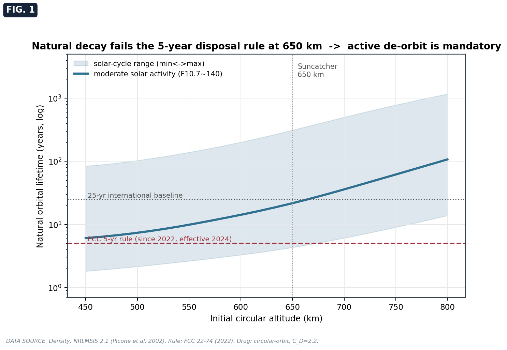
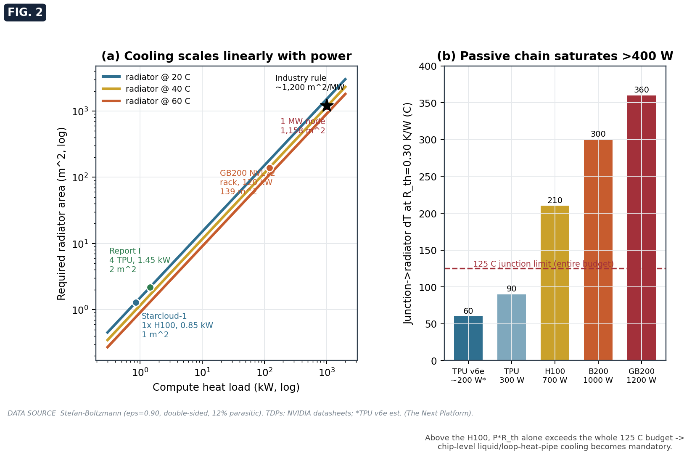
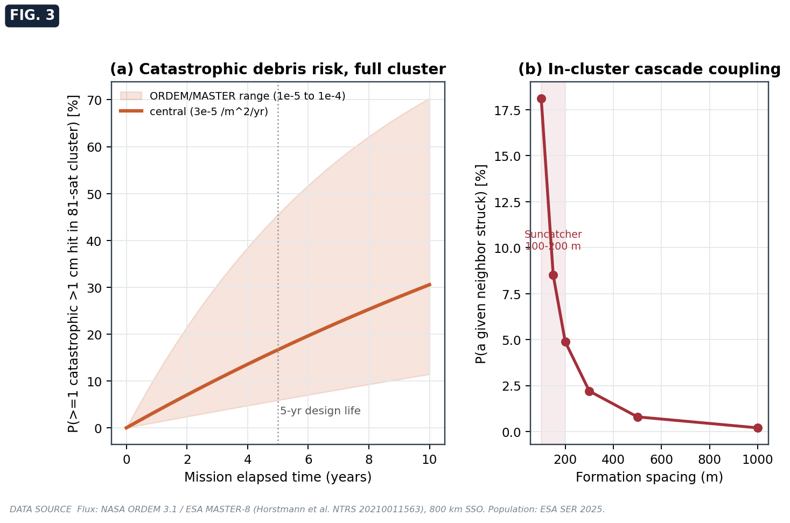
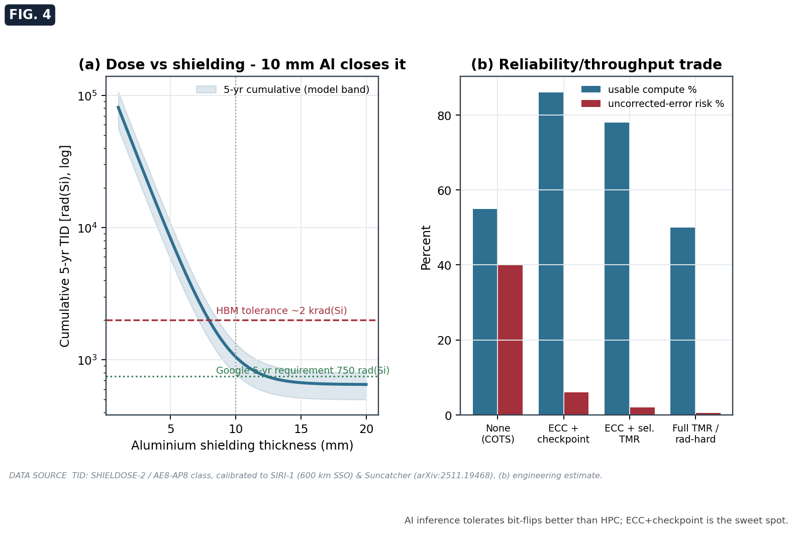
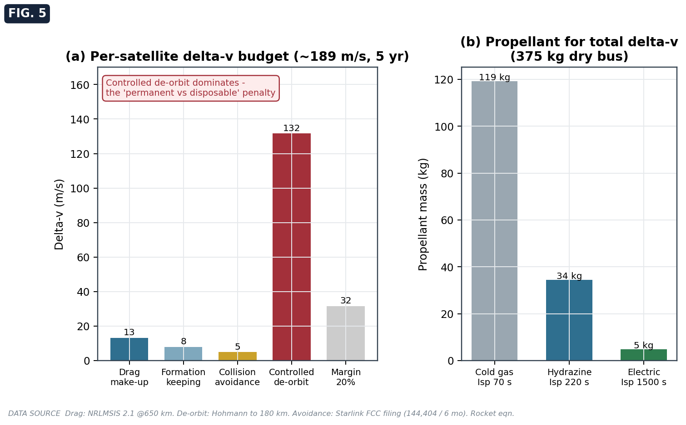
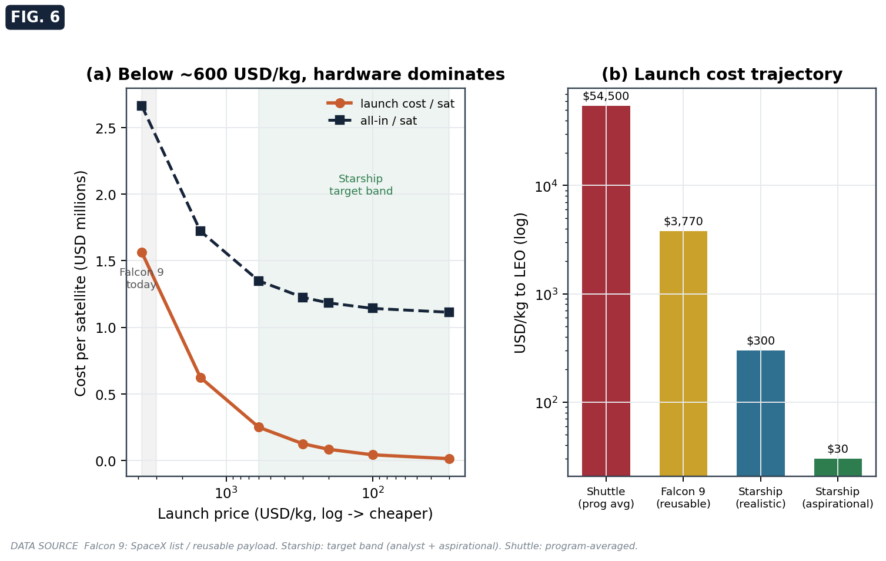
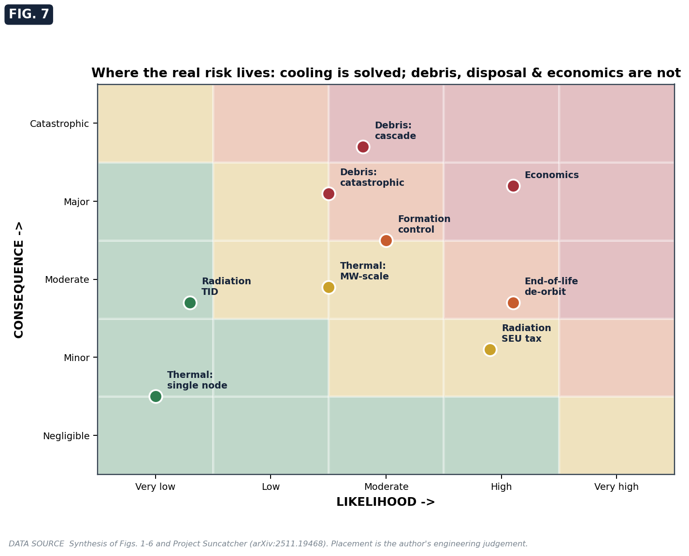

# Orbital AI Data-Center Survivability Model

A small, fully-sourced, reproducible engineering model for the **survivability, reliability,
and launch architecture** of space-based AI compute clusters. It is the open companion to the
study *Space-Based AI Data Centers, Part II*, using **Google Project Suncatcher**
([arXiv:2511.19468](https://arxiv.org/abs/2511.19468)) as the reference architecture.

> **Thesis in one line:** radiative cooling is the *solved* part of orbital AI compute (now
> flight-proven by Starcloud's H100). The unsolved parts are **orbital-debris survivability in a
> tight formation, mandatory active de-orbit, and economics.** Effort should follow the risk.

  

---

## Headline results (all reproduced by the code)

| Question | Result | Implication |
|---|---|---|
| Will a 650 km bus de-orbit in time? | Natural lifetime **~22 yr** (4 yr solar-max, 312 yr solar-min) | Fails the **FCC 5-yr rule**; active de-orbit is mandatory |
| Does cooling scale? | **~1,500 m²/MW**, and the passive chip chain saturates **>400 W** | H100/Blackwell-class parts need liquid cooling at the die |
| Debris risk to one 81-sat cluster (5 yr)? | **~17%** central (6–46% band) catastrophic | The binding constraint, worsened by the tight formation |
| In-cluster cascade at 150 m spacing? | **~8.5%** neighbor-hit per fragmentation | The "formation paradox" |
| Radiation? | **~1.06 krad/5 yr** behind 10 mm Al; SEU costs **~10–20%** throughput | Survivable, but a real tax |
| De-orbit cost? | **~132 m/s** (dominates the ~190 m/s Δv budget); ~5 kg electric prop | The permanent-vs-disposable penalty |
| Is launch cost decisive? | No — below **~$600/kg**, hardware dominates | Gated by hardware, lifetime, utilization |

## Figures

| | |
|---|---|
|  |  |
|  |  |
|  |  |
|  | Every figure carries a `DATA SOURCE` credit line. |

---

## What this is, and what it is not

**It is** a transparent, first-order model to *size problems and rank risks*, with every input
traceable to a primary source and every headline number reproduced by a unit-style check. It is
meant to be reproduced, stress-tested, or refuted under a harmonized environment model.

**It is not** a flight-design tool. It uses lumped, analytic models (circular-orbit drag, a
Stefan-Boltzmann thermal balance, Poisson impact statistics, an exponential dose-depth curve,
Hohmann/rocket-equation Δv). For mission design, use NASA DAS, ORDEM/MASTER, SPENVIS/SHIELDOSE-2,
and a full thermal/STK toolchain.

---

## Quick start

```bash
pip install -r requirements.txt
python survivability.py     # regenerates the 7 figures into ./figures and prints headline numbers
python validate.py          # 14 worked-example checks; exit 0 = all pass
```

No internet, no data files, no GPU. Pure `numpy` + `matplotlib`.

## Using the physics functions directly

```python
import survivability as s

s.orbital_lifetime(650, area_to_mass=3.5/415, scenario="mod")  # -> ~21.7 years
s.radiator_area(heat_W=1e6, temp_C=20)                         # -> ~1508 m^2
s.collision_probability(flux_per_m2_yr=3e-5, cross_section_m2=15, n_sats=81, years=5)  # -> 0.167
s.deorbit_delta_v(alt_km=650, perigee_km=180)                  # -> ~131.6 m/s
s.propellant_mass(delta_v=189.5, isp_s=1500, dry_mass_kg=375)  # -> ~4.9 kg
```

Every function is pure (no globals, no I/O) and documents its governing equation in the docstring.

---

## Repository layout

```
orbital-datacenter-survivability/
├── survivability.py     # the model: pure physics functions + figure generation
├── validate.py          # 14 worked-example assertions (lightweight CI)
├── requirements.txt
├── docs/
│   ├── METHODS.md       # every equation derived from first principles
│   └── SOURCES.md       # the verified data table with URLs and confidence flags
├── figures/             # generated PNGs (committed so the README renders)
├── CITATION.cff
└── LICENSE
```

## Governing equations (full derivations in [docs/METHODS.md](docs/METHODS.md))

| Quantity | Equation |
|---|---|
| Orbital decay | `da/dt = -C_D (A/m) ρ(h) √(μa)` |
| Radiator area | `A = Q / (ε σ T⁴ · n · (1−f_p))` |
| Junction temp | `T_j = T_rad + Q R_th` |
| Dose–depth | `D(x) = D₀ e^(−x/λ) + D_∞` |
| Debris risk | `P = 1 − e^(−Φ A N t)` |
| Cascade | `P_hit = 1 − e^(−N_f r_t² / 4d²)` |
| De-orbit Δv | `Δv = v_c1 (1 − √(2r₂/(r₁+r₂)))` |
| Propellant | `m_p = m_dry (e^(Δv/I_sp g₀) − 1)` |

## Data sources

All constants and model inputs are listed with URLs and confidence flags in
[docs/SOURCES.md](docs/SOURCES.md). Primary references include the Project Suncatcher paper,
NVIDIA/Google hardware datasheets, the ESA Space Environment Report 2025, NASA ORDEM 3.1 /
ESA MASTER-8, the NRLMSIS 2.1 atmosphere model, FCC 22-74, and SHIELDOSE-2/AE8-AP8.

The single weakest input is the **TPU v6e TDP** (undisclosed by Google; treated as ~150–200 W).
The single largest physical uncertainty is the **~100× solar-cycle density swing**, shown as a
band rather than a point.

## Citation

If you use this model, please cite it (see [CITATION.cff](CITATION.cff)):

> Biswas, S. (2026). *Orbital AI Data-Center Survivability Model* (companion to
> "Space-Based AI Data Centers, Part II"). GitHub.

## Acknowledgements

This revision exists because two readers of Part I pushed back on the survivability and
reproducibility gaps. Independent corrections and pull requests are welcome.

## License

MIT — see [LICENSE](LICENSE).
